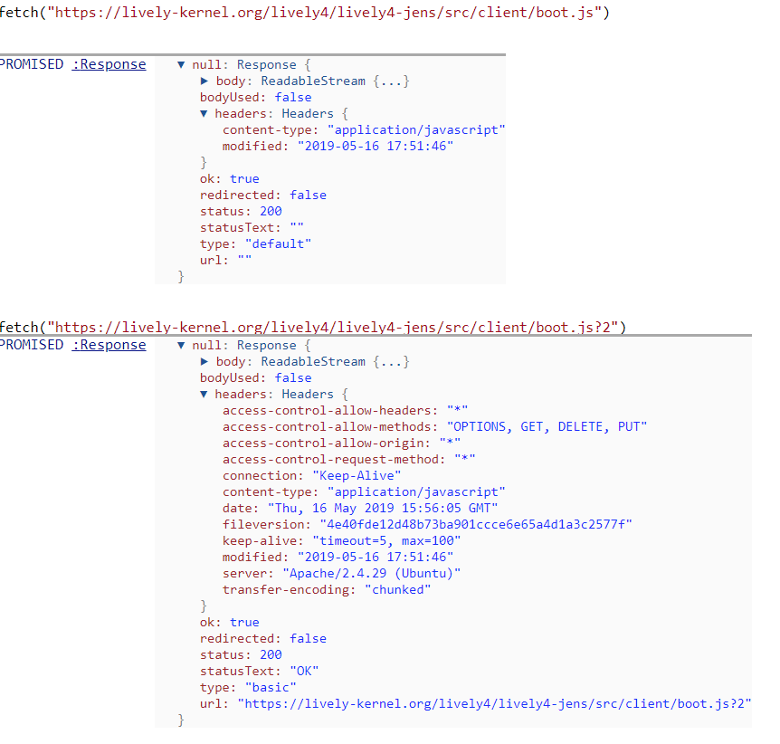

## 2019-05-16

## Lively on #Firefox

- [X] refactor event.path to event.composedPath()

## Flex Layout on #Firefox?

  
Hello

  
World

This seems to work, so flex is not the issue?

## Lively boot edit file without fileversion bug

We got edit conflicts resolved the wrong way the after editing a file a first time after booting. 

The root of the problem is the missing "fileversion" since the file was produced by fetch...

We could a) fix fetch in bootjs to add the fileversion or b) make change the editor to request something different.

