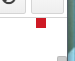
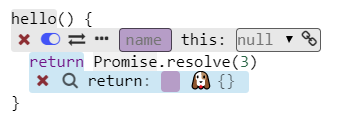
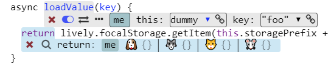

## 2019-06-05 #BP 

<style>
.screenshot {
 border: 1px solid lightgray;
}
</style> 


# Babylonian Programming Editor Issues

- [ ] Babylonian modules should go into lively bundle...
- [ ] modification editor stays red after edit.... <br> {.screenshot}
- [ ] probes has problems with promises <br>
{.screenshot}
- [ ] methods in the example constructor are also shown in the example. {.screenshot}
- [ ] function / method name cannot be selected any more with double click...


Exmample of complex constructor... that overshadows the behavior of #BP:

```javascript
async loadCredentials() {
    // this.updateLoginStatus()
    this.token = await this.loadValue("githubToken")
    if (!this.token) {
       this.token = await new Promise((resolve, reject) => {
          authGithub.challengeForAuth(Date.now(), async (token) => {
              var user = await this.githubApi("/user", token);
              var username = user.login;
              var emails =  await this.githubApi("/user/emails", token);
              var email = emails.find(ea => ea.primary).email;
              this.storeValue("githubUsername", username);
              this.storeValue("githubEmail", email);
              this.storeValue("githubToken", token);
              resolve(token);
        });
       })
    }
    this.username = await this.loadValue("githubUsername");
    this.email = await this.loadValue("githubEmail");
  }
  
  
  constructor(user= "LivelyKernel", repo= "lively4-core") {
    this.user = user
    this.repo = repo
    this.loaded = this.loadCredentials()
  }
  ```

<script>
  // fix images that are displayed to large... #Hack #Images #Resize
  this.parentElement.querySelectorAll("img").forEach(ea => {

    ea.width = 0.8 * ea.width

  })
</script>