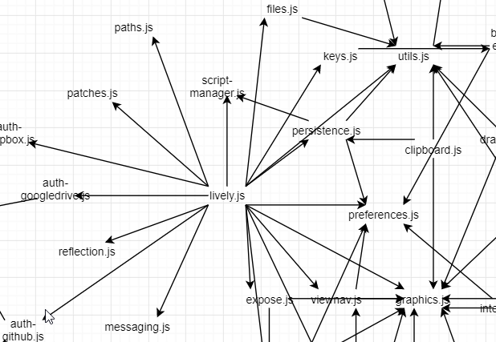

## 2019-06-07 A lot of #drawio

 - [Figure 1](../../figures/figure1.drawio)

## Some Simple DrawIO Text Editor

<script>
(async () => {
  var result = await lively.create("div")
  
  var editor = await lively.create("lively-code-mirror")
  lively.setExtent(editor, lively.pt(600,400))
  var inspector = await lively.create("lively-inspector")
  lively.setExtent(inspector, lively.pt(600,400))
  lively.setPosition(inspector, lively.pt(600,0))
  
  var drawio = lively.query(this, "lively-drawio")
  await editor.loaded
  editor.editor.setOption("mode", "xml")
  editor.value = await drawio.getSource(true)
  
  editor.addEventListener("keydown", async (evt) => {
    var char = String.fromCharCode(evt.keyCode || evt.charCode);
    if ((evt.ctrlKey || evt.metaKey /* metaKey = cmd key on Mac */) && char == "S") {
      await drawio.setSource(editor.value)
      
      drawio.updateGraphModel()
      
      evt.stopPropagation();
      evt.preventDefault();
    }
  })

  async function updateGraphModel() {
    var doc = await drawio.getGraphModel()
    inspector.inspect(doc.documentElement)  
  }
  updateGraphModel()


  return  (<div style="position: relative; border: 1px solid blue">{editor}{inspector}</div>)
})()
</script>

<div style="border: 2px solid gray">
<lively-drawio src="drwaio2.xml"></lively-drawio>
</div>

---

This looks like this:


----

# Generating DrawIO 

```javascript

var nodes = [{label: "hello"}, {label: "world"}]
var edges = [{source: nodes[0], target: nodes[1]}]

var idMap = new Map()

var counter=2

function ensureId(object) {
  var id = idMap.get(object)
  if (!id) {
    id = counter++
    idMap.set(object, id)
  }
  return id
}

var nodesSource = nodes.map(ea => {
  var id = ensureId(ea)
 return `<mxCell id="${id}" value="Text" style="text;html=1;strokeColor=none;fillColor=none;align=center;verticalAlign=middle;whiteSpace=wrap;rounded=0;" vertex="1" parent="1">
      <mxGeometry x="210" y="${id * 50}" width="40" height="20" as="geometry"/>
    </mxCell>
 `
}).join("\n")
 
var edgesSource = edges.map(ea => {
  var id = ensureId(ea)
  var fromId = ensureId(ea.source)
  var toId = ensureId(ea.target)

  
  return `<mxCell id="${id}" value="" style="edgeStyle=orthogonalEdgeStyle;rounded=0;orthogonalLoop=1;jettySize=auto;html=1;" edge="1" parent="1" source="${fromId}" target="${toId}">
        <mxGeometry relative="1" as="geometry"/>
      </mxCell>` 
}).join("\n");

var source = `<mxGraphModel dx="1718" dy="1071" grid="1" gridSize="10" guides="1" tooltips="1" connect="1" arrows="1" fold="1" page="1" pageScale="1" pageWidth="1654" pageHeight="1169" math="0" shadow="0">
  <root>
    <mxCell id="0"/>
    <mxCell id="1" parent="0"/>
    ${nodesSource}
    ${edgesSource}
  </root>
</mxGraphModel>
`
that.setSource(source)
```


----

# And not with real data



[result drawio](drwaio3.xml) after applying layout in editor....

So we can now

a) Generate a Graph Visualization
b) Generate a Graph Visualization and manually edit it
c) #Challenge: Update a manually edited graph with generated data?


```
import {loadedModulesData} from "demos/visualizations/filedata.js" 

var url = lively4url + "/src/client/";


(async () => {
  var graph = await loadedModulesData(url)
  
var nodesSource = graph.nodes.children.map(ea => {
  var id = ea.id
 return `<mxCell id="${id}" value="${ea.label}" style="text;html=1;strokeColor=none;fillColor=none;align=center;verticalAlign=middle;whiteSpace=wrap;rounded=0;" vertex="1" parent="1">
      <mxGeometry x="210" y="${id * 50}" width="40" height="20" as="geometry"/>
    </mxCell>
 `
}).join("\n")

var edgesSource = graph.relations.map((ea,index) => {
  var id = "e-" + index
  var fromId = ea.source
  var toId = ea.target
  
  return `<mxCell id="${id}" value="" style="edgeStyle=orthogonalEdgeStyle;rounded=0;orthogonalLoop=1;jettySize=auto;html=1;" edge="1" parent="1" source="${fromId}" target="${toId}">
        <mxGeometry relative="1" as="geometry"/>
      </mxCell>` 
}).join("\n");

var source = `<mxGraphModel dx="1718" dy="1071" grid="1" gridSize="10" guides="1" tooltips="1" connect="1" arrows="1" fold="1" page="1" pageScale="1" pageWidth="1654" pageHeight="1169" math="0" shadow="0">
  <root>
    <mxCell id="0"/>
    <mxCell id="1" parent="0"/>
    ${nodesSource}
    ${edgesSource}
  </root>
</mxGraphModel>
`
that.setSource(source)
})()


```

