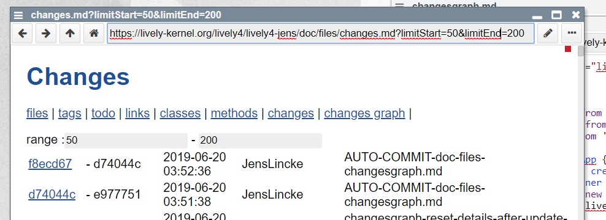
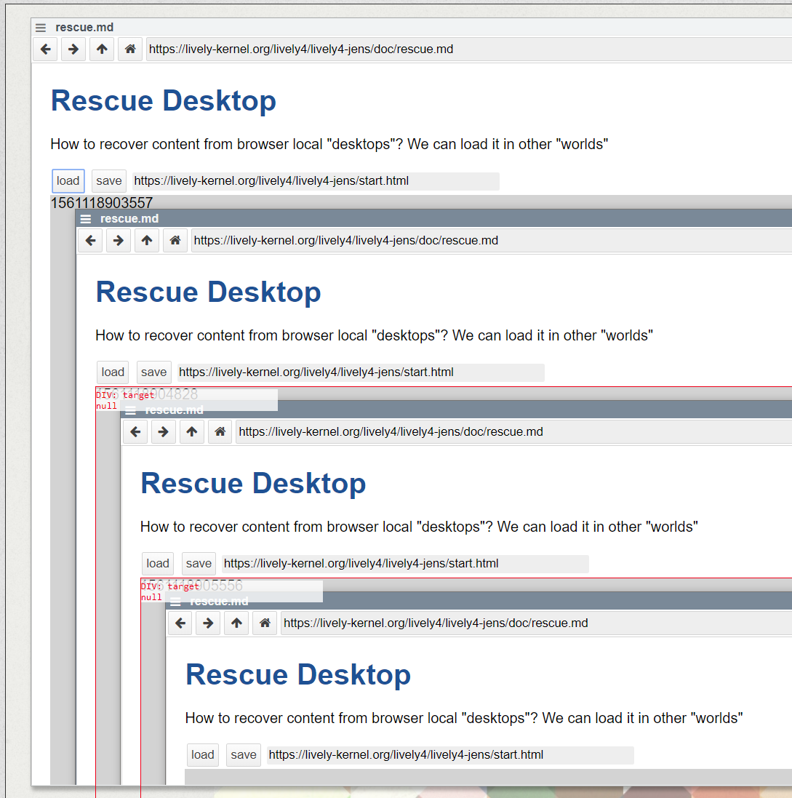

## 2019-06-21 Apps in #Markdown

###  Sync Script


```markdown
<script>
  import moment from "src/external/moment.js";  
  
  var div = document.createElement("div")
  // ...
  
  return div
</script>

```

###  Async Script


```markdown
<script>
  import moment from "src/external/moment.js";  
  var container = lively.query(this, "lively-container");
  (async () => {
    var table = await lively.create("table", this)
    
    
    // ...
    var div = document.createElement("div")
    div.appendChild(table)
    return div
  })()
</script>

```


### Static Class 

```markdown
<script>
  import moment from "src/external/moment.js"
  
  class ChangesApp {
    static async create(ctx) {
    
    var table = await lively.create("table", ctx)
   
     var div = document.createElement("div")
      div.appendChild(table)
      return div
    }
  }
  ChangesApp.create(this)
</script>
```


### Static Class 

```markdown
<script>
  import moment from "src/external/moment.js"
  
  class ChangesApp {
    static async create(ctx) {
    
    var table = await lively.create("table", ctx)
   
     var div = document.createElement("div")
      div.appendChild(table)
      return div
    }
  }
  ChangesApp.create(this)
</script>
```

### Custom Elements....

Use Web-components etc... since we have to register tags for this...


### Parameter for Markdown Apps


URL parameters


```
https://lively-kernel.org/lively4/lively4-jens/doc/files/changes.md?limitStart=50&limitEnd=200
```

Cam be extracted like this....

```javascript
  var container = lively.query(ctx, "lively-container");
  var params = container.getURL().searchParams
  var limitStart = params.get("limitStart") || 0 
```




### Inception




