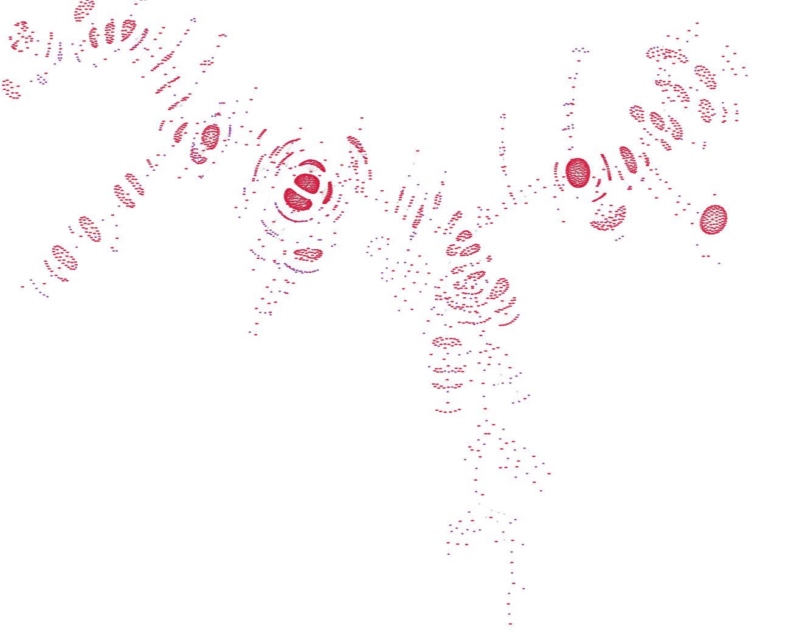
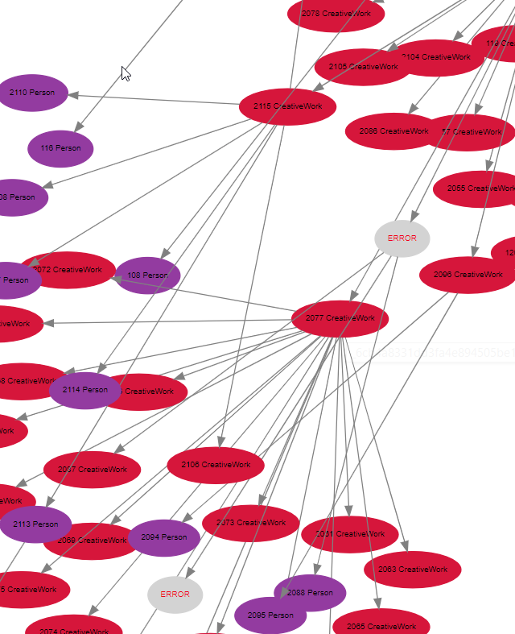

## 2019-06-26

server side graphviz

```js
fetch("https://lively-kernel.org/lively4S2/_graphviz/", {
  method: "POST",
  headers: {
    graphtype: "svg",
    graphlayout: "neato"
  },
  body: `digraph {
      a -> b;
      b -> c;
      c -> a;
  }`
}).then(r => r.text()).then( source => {
  that.innerHTML = source
})
```




but there is lots to do...

