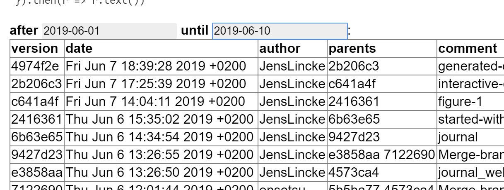

## 2019-06-28 

## Get Changes from a time period

```
fetch("http://localhost:9006/lively4-core/", {
method: "OPTIONS",
headers: {
  showversions: "true",
  gitafter: "2019-06-01",
  gituntil: "2019-06-10",
}
}).then(r => r.text())
```

<script>
(async() => {
  var result = await (<lively-table></lively-table>)
  var after = <input value="2019-06-01" /> 
  var until = <input value="2019-06-10"/> 
  async function update() {
    var changes = await fetch("http://localhost:9006/lively4-core/", {
      method: "OPTIONS",
      headers: {
        showversions: "true",
        gitafter: after.value,
        gituntil: until.value,
      }
      }).then(r => r.json())
      debugger
      result.setFromJSO(changes.versions)
  }
  after.addEventListener("changed", function(){ after.value=this.value; update() })
  until.addEventListener("change", function(){ until.value=this.value; update() })
  
  update()
  
  return <div><b>after</b> {after} <b>until</b> {until}:<br/>{result}</div>
})()
</script>



## #Poid #Wikipedia links support

Example:

```
[awk](wikipedia://en/AWK) 
```
[awk](wikipedia://en/AWK) 


