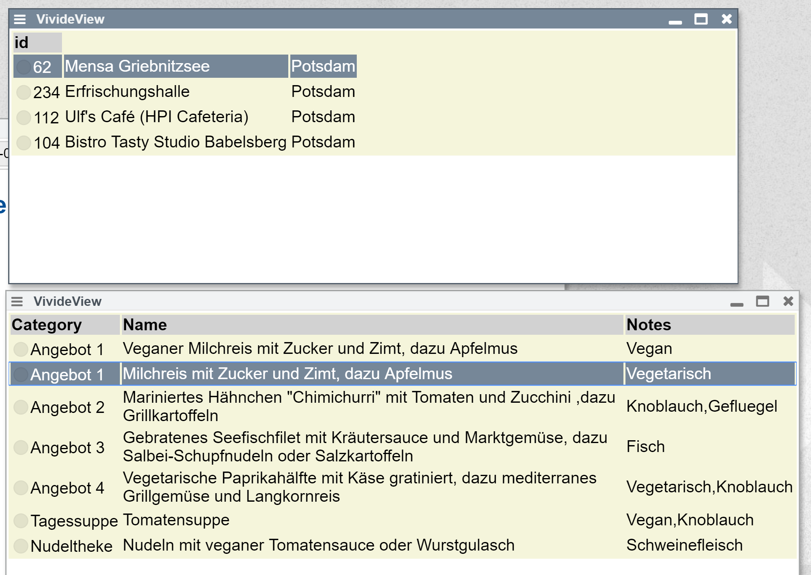

## 2019-07-10 OpenMensa API with Vivide



### Mensa View

```JavaScript
[async function* transform(input) {
// let canteenID = 62;
// let dayDate = new Date().toFormattedString('yyyy-MM-dd')
let url = `https://openmensa.org/api/v2/canteens?near[lat]=52.393535&near[lng]=13.127814&near[dist]=5`;

yield url.fetchJSON();
}, {
  widget: 'table'
}]
```

```JavaScript
[item => ({
  label: item.id
}), {
  header: 'id'
}]
```

```JavaScript
[item => ({
  label: item.name
}), {
  
}]
```

```JavaScript
[item => ({
  label: item.city
}), {
  
}]
```

### Connected Meal View

```JavaScript
[async function* transform(input) {
  for await (let city of input) {
    let canteenID = city.id;
    let dayDate = new Date().toFormattedString('yyyy-MM-dd')
    let url = `https://openmensa.org/api/v2/canteens/${canteenID}/days/${dayDate}/meals`;
    try {
      let json = url.fetchJSON();
      yield json;
    } catch (e) {}
  }
}, {
  widget: 'table'  
}]
```

```JavaScript
[item => ({
  label: item.category
}), {
  header: 'Category'
}]
```

```JavaScript
[item => ({
  label: item.name
}), {
  header: 'Name'
}]
```

```JavaScript
[item => ({
  label: item.notes
}), {
  header: 'Notes'
}]
```
