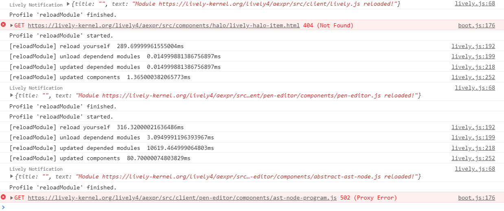

## 2019-08-09

### PenEditor (1 File)
- [reloadModule] updated depended modules  1309.8600003868341ms
- /lively4/aexpr/src/client/lively.js!transpiled:280 [reloadModule] updated components  4.830000922083855ms
- /lively4/aexpr/src/client/lively.js!transpiled:230 [reloadModule] reload yourself  289.69999961555004ms
- /lively4/aexpr/src/client/lively.js!transpiled:236 [reloadModule] unload dependend modules  0.014999881386756897ms
- /lively4/aexpr/src/client/lively.js!transpiled:255 [reloadModule] updated depended modules  0.014999881386756897ms
- /lively4/aexpr/src/client/lively.js!transpiled:287 [reloadModule] updated components  1.365000382065773ms

### Abstract AST Node (~100 Files)

- /lively4/aexpr/src/client/lively.js!transpiled:230 [reloadModule] reload yourself  316.32000021636486ms
- /lively4/aexpr/src/client/lively.js!transpiled:236 [reloadModule] unload dependend modules  3.0949991196393967ms
- /lively4/aexpr/src/client/lively.js!transpiled:255 [reloadModule] updated depended modules  10619.464999064803ms
- /lively4/aexpr/src/client/lively.js!transpiled:287 [reloadModule] updated components  80.70000074803829ms