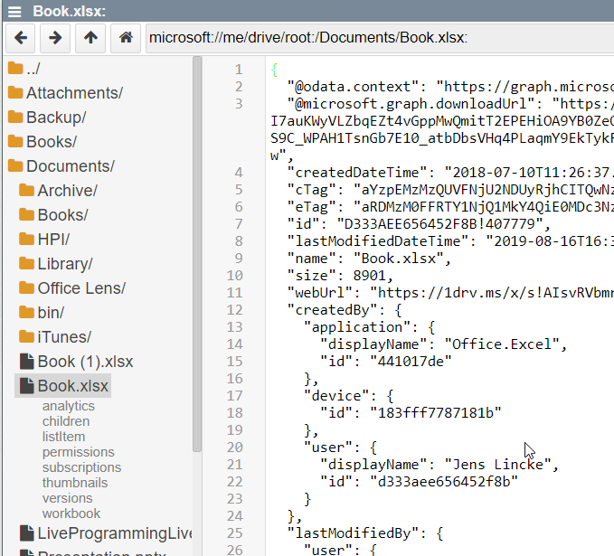
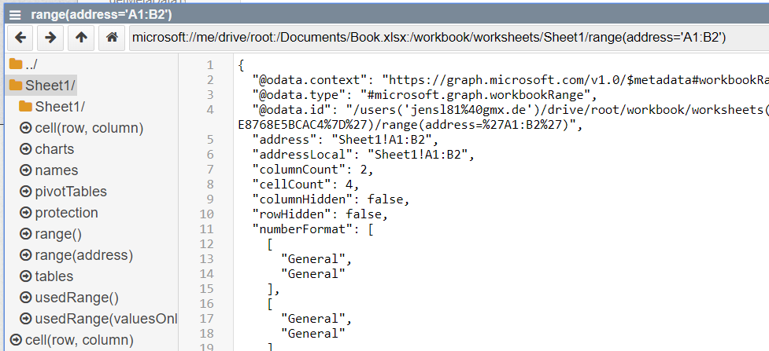
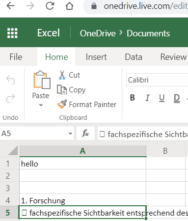

## 2019-08-16 #Microsoft Graph API


and here we go...


## Navigating in OneDrive 




## Navigating to (Excel) Worksheet




## Getting Data out of the Worksheet with `fetch`

```javascript
fetch("microsoft://me/drive/root:/Documents/Book.xlsx:/workbook/worksheets/Sheet1/range(address='A1:A1')").then(r => r.json())
```

## And getting Data into the Worksheet with a `PATCH` request

```javascript

fetch("microsoft://me/drive/root:/Documents/Book.xlsx:/workbook/worksheets/Sheet1/range(address='A1:A1')", {
  method: "PATCH",
  body: JSON.stringify({
    values: [["hello"]]
  })
}).then(r => r.text())
```

And Voila




