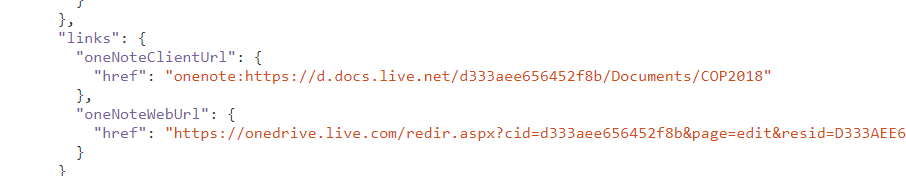

## 2019-08-19

### Microsoft uses POID ;-) #RelatedWork




```javascript
 {
      "id": "0-D333AEE656452F8B!405118",
      "self": "https://graph.microsoft.com/v1.0/users/jensl81@gmx.de/onenote/notebooks/0-D333AEE656452F8B!405118",
      "createdDateTime": "2017-12-20T14:04:21.77Z",
      "displayName": "COP2018",
      "lastModifiedDateTime": "2018-01-22T09:34:21.603Z",
      "isDefault": false,
      "userRole": "Owner",
      "isShared": true,
      "sectionsUrl": "https://graph.microsoft.com/v1.0/users/jensl81@gmx.de/onenote/notebooks/0-D333AEE656452F8B!405118/sections",
      "sectionGroupsUrl": "https://graph.microsoft.com/v1.0/users/jensl81@gmx.de/onenote/notebooks/0-D333AEE656452F8B!405118/sectionGroups",
      "createdBy": {
        "user": {
          "id": "D333AEE656452F8B",
          "displayName": "Jens Lincke"
        }
      },
      "lastModifiedBy": {
        "user": {
          "id": "D333AEE656452F8B",
          "displayName": "Jens Lincke"
        }
      },
      "links": {
        "oneNoteClientUrl": {
          "href": "onenote:https://d.docs.live.net/d333aee656452f8b/Documents/COP2018"
        },
        "oneNoteWebUrl": {
          "href": "https://onedrive.live.com/redir.aspx?cid=d333aee656452f8b&page=edit&resid=D333AEE656452F8B!405118"
        }
      }
    },
```