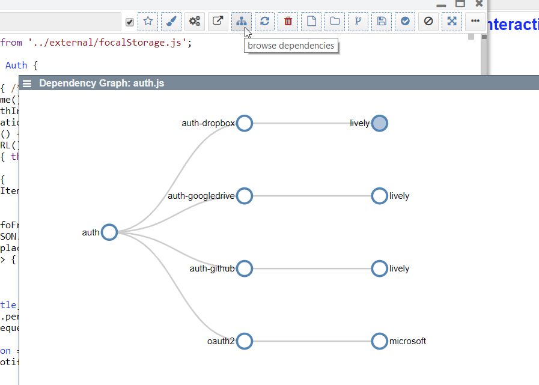

## 2019-09-03 #Keyboard Interaction Design Session

### Issue: Alt-Left

- currently: used to navigate on file content level (vs. chars and lines)
- instead: use only alt+Backspace
- future: use for AST Semantic Navigation #PenEditor

### Issue: Enter

- currently: only selects, but does not yield focus
- future: navigate down into content (and yield focus)

### Issue: Arrow Key Navigation

- currently: only move cursor (in navbar)
- future: select and update content, without yielding focus
- special case: keep cursor navigation for directories (enter required)

### Issue: Arrow Key in CodeMirror

- propagate cursor changed to container-navbar
- navbar should have a notion of positions of semantic sections (such as a method) and update its selection / cursor

## Explore Visualization / Behavior

Use Case: Explore Visualizations 
Challenge: Domain logic that created the interactive tree is lost in the UI. The explorable UI consists only of a generic d3-tree... The code that created the tree is executed somewhere between clicking on the button and the displayed views... 

- (A) How to make a system more explorable backward starting from some existing UI... a la WhyLine
- (B) How to trace, visualize, and explore (navigate) behavior while stimulating a system (via mouse / keyboard input / or else)

- Why not see who and where contributed to the created objects and the observable behavior

