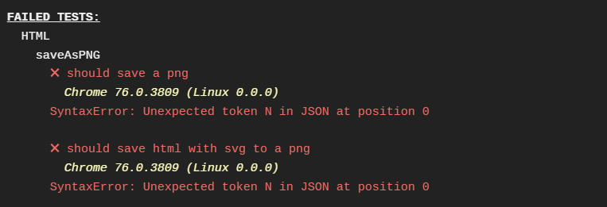
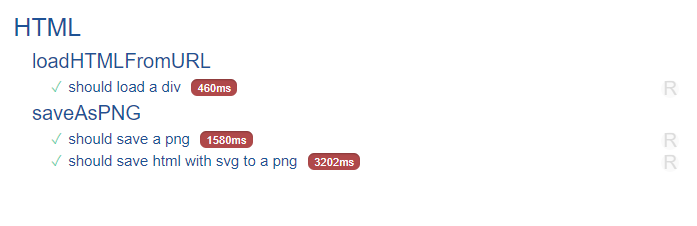
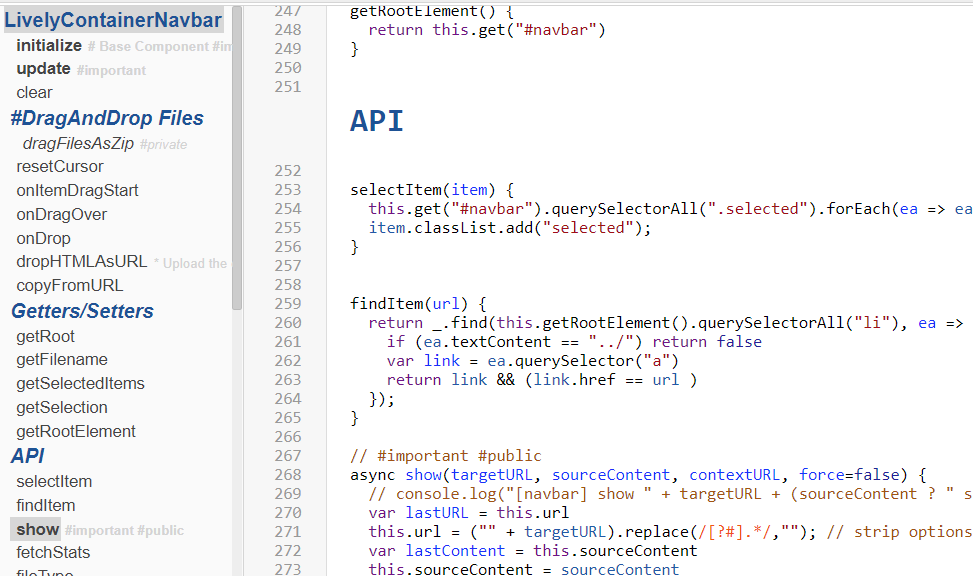

## 2019-09-06 #Travis Test fail

Our [html-test](edit://test/client/html-test.js) fails on travis:




But seems to pass locally, but slowly




So I think I will disable them for now:

```javascript
describe('saveAsPNG', () => {
    it('should save a png ', async (done) => {
      try {
        var url = await lively.html.saveAsPNG(lively4url + "/test/sample-a.html")
        expect(url).to.match(/png$/)
        await fetch(url, {
          method: "DELETE"
        })
        done()        
      } catch(e) {
        done(e)
      }
    });

    it('should save html with svg to a png ', async (done) => {
      try {
        var url = await lively.html.saveAsPNG(lively4url + "/test/sample-b.html")
        expect(url).to.match(/png$/)
        await fetch(url, {
          method: "DELETE"
        })
        done()        
      } catch(e) {
        done(e)
      }
    }).timeout(30000);

    
  })
```

## #Navbar now support Markdown in JS Details

Some foobar test file:


And the emerging structure of the navbar component js file itself.



It is Friday 20:40, Jazz is playing, I had much fun, but I should go home now!


