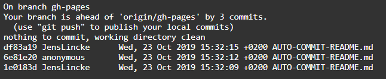

## 2019-10-23 ## 2019-10-23 No Identity Theft any more!

As a side affect of full authentification/authorization support we can send now authentification information with every PUT request. This will hopefully help our group work...

