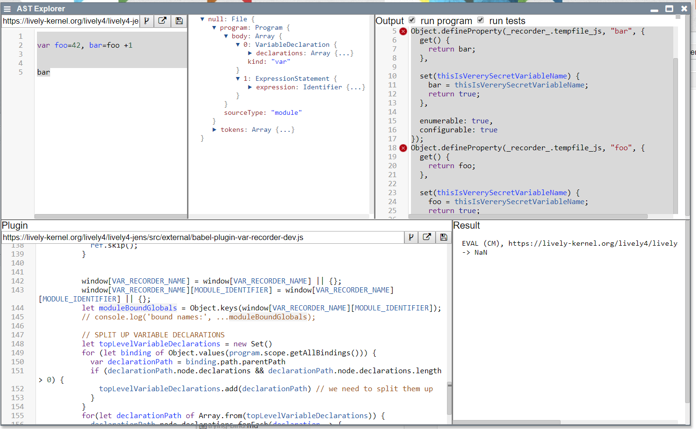

## 2019-11-13 Working on Var Recorder 

- [babel-plugin-var-recorder.js](browse://src/external/babel-plugin-var-recorder.js) 


```javascript
import foo from "src/client/html.js"

export var a = "hello"


export function c() {
  var b = a + " world"
  foo
  return b
}
```

Currently it will be translated to:

```javascript
_recorder_.tempfile_js = _recorder_.tempfile_js || {};
_recorder_.tempfile_js.c = c;
import foo from "src/client/html.js";

_recorder_.tempfile_js.foo = foo;
export var a = "hello";

_recorder_.tempfile_js.a = a;
export function c() {
  var b = _recorder_.tempfile_js.a + " world";
  _recorder_.tempfile_js.foo;
  return b;
}
```

The problem we want to fix is line 5 `_recorder_.tempfile_js.foo = foo;`: our imported "foo" module is aliased into our global var recorder and SystemJS does not know about it!

**Idea**: We replace the aliasing asignment with a property get/set that will store the values the original variable, but still make the variable accessible from outside the scope. 

**Idea 2**: Maybe we could provide such tunnels / wormholes into other more deeply nested scopes...

**BUT** that would mean inserting a lot of getter/setter defitions into code... worsening the performance... 

OK, but lets work on the first level for now. 

```javascript
var a = 3

var myRecorderForId = {
  get foo() { return a },
  set foo(v) { return a = v }
}

myRecorderForId.foo = 4


a  //  4 it works!
```

but we need something more like this!


```javascript
var a = 3
var recorder = {}

Object.defineProperty(recorder, 'a', {
  get() { return a; },
  set(newValue) {a = newValue; return true },
  enumerable: true,
  configurable: true
});

recorder.a = 4

a  //  4 it works!
```

## It gets more complicated than expected....

```javascript
var a = 42, b = a + 3;


a = a + 1;
```

1. we should split up variable declarations into a declaration and assignment.
2. the declaration should only happen if not already declared
   - the declaration should be changed to to kind "var" (let, var, const -> var)
3. the var-recorder-property for our variable should only be declared once
4. after this the assignment can happen


```javascript
_recorder_.tempfile_js = _recorder_.tempfile_js || {};

if (!_recorder_.tempfile_js.hasOwnProperty("a")) {
  var a
}
if (!_recorder_.tempfile_js.hasOwnProperty("a")) {
  Object.defineProperty(_recorder_.tempfile_js, "a", {
    get() {
      return a;
    },

    set(thisIsVererySecretVariableName) {
      a = thisIsVererySecretVariableName;
      return true;
    },

    enumerable: true,
    configurable: true
  });
}

recorder_.tempfile_js.a  = 42

var b = _recorder_.tempfile_js.a + 3;

if (!_recorder_.tempfile_js.hasOwnProperty("b")) {
  Object.defineProperty(_recorder_.tempfile_js, "b", {
    get() {
      return b;
    },

    set(thisIsVererySecretVariableName) {
      b = thisIsVererySecretVariableName;
      return true;
    },

    enumerable: true,
    configurable: true
  });
}


_recorder_.tempfile_js.a = _recorder_.tempfile_js.a + 1;
```

## Open Issues:

The semantics of `var` and `let` should be pretty similar on a global level... **BUT** there are differences... but that will worry only "future us".

```
a // undefined

var a = 42
```

But let throws an reference error:

```
a // reference error

let a = 42
```

## New Issue:

```


if (true) {
  var a = 4
}

a = 3;

a // -> 4
```

Gets now rewritten to:


```javascript
_recorder_.tempfile_js = _recorder_.tempfile_js || {};

if (true) {
  var a = 4;

  if (!_recorder_.tempfile_js.hasOwnProperty("a")) {
    Object.defineProperty(_recorder_.tempfile_js, "a", {
      get() {
        return a;
      },

      set(thisIsVererySecretVariableName) {
        a = thisIsVererySecretVariableName;
        return true;
      },

      enumerable: true,
      configurable: true
    });
  }
}

_recorder_.tempfile_js.a = 3;

_recorder_.tempfile_js.a;
```

This first time it works, but the second time it breaks... ok `var a = 4` is not rewritten yet.


## Order of Execution

```javascript
var foo=42, bar=foo +1
bar
```
and it gets mixed up, because we use "insertAfter"


```javascript
_recorder_.tempfile_js = _recorder_.tempfile_js || {};
var foo;
var bar;
"(var...)";
Object.defineProperty(_recorder_.tempfile_js, "bar", {
  get() {
    return bar;
  },

  set(thisIsVererySecretVariableName) {
    bar = thisIsVererySecretVariableName;
    return true;
  },

  enumerable: true,
  configurable: true
});
Object.defineProperty(_recorder_.tempfile_js, "foo", {
  get() {
    return foo;
  },

  set(thisIsVererySecretVariableName) {
    foo = thisIsVererySecretVariableName;
    return true;
  },

  enumerable: true,
  configurable: true
});
_recorder_.tempfile_js.bar = _recorder_.tempfile_js.foo + 1;
_recorder_.tempfile_js.foo = 42;


_recorder_.tempfile_js.bar;
```


## Idea: Generate TestCase in AST Exploerer?

There is a button and UI missing that generates and conitiuesly executes "TestCases"
for our transformations.

- Input: Source + Expected Evaluation Result
- Run: check if it evaluates....
- example source should be replace by a per plugin set of examples with expected results...



## But on a Module level we still have problems

```javascript
(function(System, SystemJS) {System.register(["./foobar.js"], function (_export, _context) {
  "use strict";

  var foobar, me;
  function foo(a) {
    return 11 + a + _recorder_._demos_foo_js.foobar();
  }

  _export("default", foo);

  return {
    setters: [function (_foobarJs) {
      foobar = _foobarJs.default; // THIS LINE GETS EXECUTED BY SYSTEMJS ON UPDATE
    }],
    execute: function () {
      _recorder_._demos_foo_js = _recorder_._demos_foo_js || {};
      Object.defineProperty(_recorder_._demos_foo_js, "foo", {
        get() {
          return foo;
        },

        set(thisIsVererySecretVariableName) {
          _export("default", foo = thisIsVererySecretVariableName);

          return true;
        },

        enumerable: true,
        configurable: true
      });
      Object.defineProperty(_recorder_._demos_foo_js, "foobar", {
        get() {
          return foobar;
        },

        set(thisIsVererySecretVariableName) {
          foobar = thisIsVererySecretVariableName;
          return true;
        },

        enumerable: true,
        configurable: true
      });
      "(var...)";
      Object.defineProperty(_recorder_._demos_foo_js, "me", {
        get() {
          return me;
        },

        set(thisIsVererySecretVariableName) {
          me = thisIsVererySecretVariableName;
          return true;
        },

        enumerable: true,
        configurable: true
      });
      _recorder_._demos_foo_js.me = 4 + Math.random();
      /*MD # Hello World MD*/

      class Foo5 {

        // #important
        bar2() {}

        // #FOO2
        get blue() {}

        // #TAG
        set blue(b) {}
        /*MD
        # Here come methods
        
        
        MD*/
        // #private
        m5() {}

        // #3
        // #TagMe
        m11() {}

        // #deprecated
        hello() {}
        /*MD
        ## and other
        
        
        MD*/
        // #p
        dosomthing() {}

        static m2() {}

      }

      Object.defineProperty(_recorder_._demos_foo_js, "Foo5", {
        get() {
          return Foo5;
        },

        set(thisIsVererySecretVariableName) {
          Foo5 = thisIsVererySecretVariableName;
          return true;
        },

        enumerable: true,
        configurable: true
      });
      console.log("LOADED foo.js - " + _recorder_._demos_foo_js.me);
    }
  };
});
})(System, System);

```

## And export makes problems

Currently module `foo.js` exports the variable `c` and with it's current value

```javascript
export var c = 3
c = 4
```


```javascript
import {c} from "demos/foo.js"

c // 3 but expected 4 (browser native behavior)
```

See <demos/main.html>


### How SystemJS  does "export"

```javascript
export var c = 3;
c = 4;

export function foo() {
  c++
}
```

As we can see, whenever somebody writes into `c` the `_export` function is called....

```javascript
(function(System, SystemJS) {System.register([], function (_export, _context) {
  "use strict";

  var c;
  function foo() {
    _export("c", c + 1), c++;
  }

  _export("foo", foo);

  return {
    setters: [],
    execute: function () {
      _export("c", c = 3);

      _export("c", c);

      _export("c", c = 4);
```

But our old Var-Recorder produced this:

```javascript
(function(System, SystemJS) {System.register([], function (_export, _context) {
  "use strict";

  var c;
  function foo() {
    _recorder_._demos_foo2_js.c++;
  }

  _export("foo", foo);

  return {
    setters: [],
    execute: function () {
      _recorder_._demos_foo2_js = _recorder_._demos_foo2_js || {};
      _recorder_._demos_foo2_js.foo = foo;

      _export("c", c = 3);

      _export("c", c);

      _recorder_._demos_foo2_js.c = c;

      _recorder_._demos_foo2_js.c = 4;
```

## And our new recoder works better in this regard  (but still has other problems)

### export

```javascript
export var c = 3
c = 4
```

becomes:

```javascript
System.register([], function (_export, _context) {
  "use strict";

  return {
    setters: [],
    execute: function () {
      _recorder_.tempfile_js = _recorder_.tempfile_js || {};
      var c = undefined;

      _export("c", c);

      if (!_recorder_.tempfile_js.hasOwnProperty("c")) {
        Object.defineProperty(_recorder_.tempfile_js, "c", {
          get() {
            return c;
          },

          set(thisIsVererySecretVariableName) {
            _export("c", c = thisIsVererySecretVariableName);

            return true;
          },

          enumerable: true,
          configurable: true
        });
      } else {
        _recorder_.tempfile_js.c = c;
      }

      _recorder_.tempfile_js.c = 3;

      const __result__ = _recorder_.tempfile_js.c = 4;

      _export("__result__", __result__);
    }
  };
});
```

### import

```javascript
import foo from "demos/foo.js"
```


```javascript
System.register(["demos/foo.js"], function (_export, _context) {
  "use strict";

  var foo;
  return {
    setters: [function (_demosFooJs) {
      foo = _demosFooJs.default; 
    }],
    execute: function () {
      _recorder_.tempfile_js = _recorder_.tempfile_js || {};

      if (!_recorder_.tempfile_js.hasOwnProperty("foo")) {
        Object.defineProperty(_recorder_.tempfile_js, "foo", {
          get() {
            return foo;
          },

          set(thisIsVererySecretVariableName) {
            foo = thisIsVererySecretVariableName;
            return true;
          },

          enumerable: true,
          configurable: true
        });
      } else {
        _recorder_.tempfile_js.foo = foo;
      }
    }
  };
});
```


## Doit through shared bindings works...

*foo.js:*
```javascript
export var c = 3
```

*main.js:*
```javascript
import {c} from "./foo.js"

c // this is 3
```

but after a doit:

*foo.js:*
```javascript
c = 8 // DoIt
```

*main.js:*
```javascript
c // it becomes 8
```

**BUT**: after a full "SAVE"
*foo.js:*
```javascript
export var c = 3
```
it becomes.... #Bug #TODO

*main.js:*
```javascript
c // undefined..
```

Good luck to ourselves... figuring this out.


