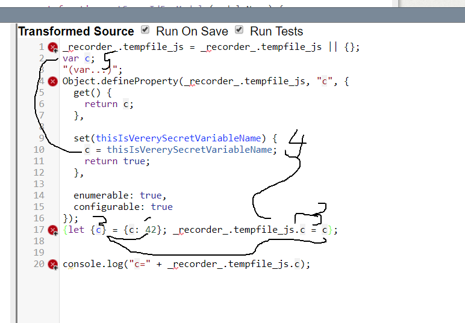

## 2019-12-12 #VarRecorder again




```javascript

var {b, c} = {b: 42, c:7}

console.log("b=" + b + " c=" + c)


// var {a, b: c}= {a: 5, b: 8}
 
var{a, b: c, d: [e,, f, ...g],} = {a: 5, b: 8, d: [3, 4, 5, 6, 7]}


console.log("a=" + a + " c=" + c + " e=" + e + " f=" + f + " g=" + g )
```