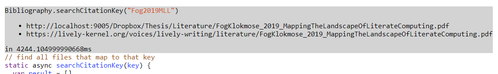

## 2020-01-15 #Bibliography
*Author: @JensLincke*


[searchCitationKey](edit://src/client/bibliography.js#searchCitationKey) works... but it takes time, given that it has to compare all file names. 





- [x] generate citationKey per file while indexing! #TODO

## Index for citation keys...

```javascript
import FileIndex from "src/client/fileindex.js"

FileIndex.current().db.files.where("bibkey").equals("Bainomugisha2011BSP").toArray()
```


And we can use fetch and browse it it <bib://Bainomugisha2011BSP>