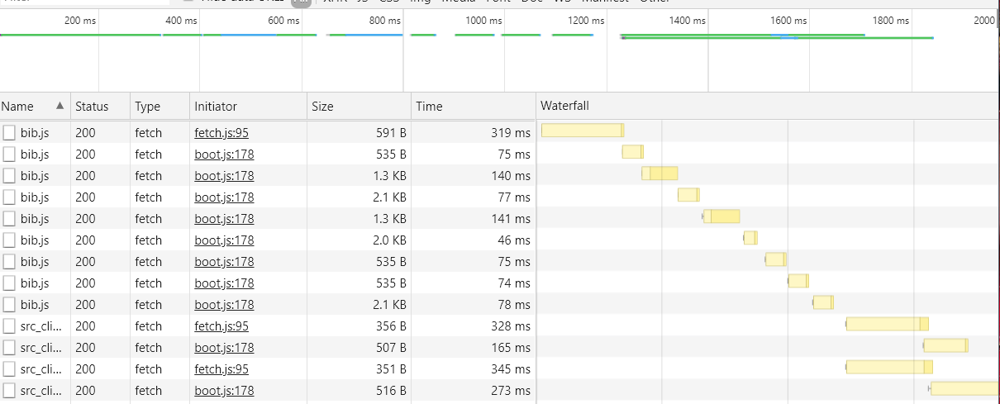

## 2020-01-17
*Author: @JensLincke*




## Saving can be slow... this is why:

```
14:09:29.538 fetch.js:244 AuthorizedFetch Write: https://lively-kernel.org/lively4/lively4-jens/src/client/protocols/bib.js
14:09:29.538 fetch.js:94 PROXY reqest: PUT https://lively-kernel.org/lively4/lively4-jens/src/client/protocols/bib.js
14:09:29.864 fileindex.js:685 [fileindex] updateFile https://lively-kernel.org/lively4/lively4-jens/src/client/protocols/bib.js
14:09:29.944 fileindex.js:701 [fileindex] addFile https://lively-kernel.org/lively4/lively4-jens/src/client/protocols/bib.js
14:09:30.351 fileindex.js:507 findModifiedClassesAndMethods  https://lively-kernel.org/lively4/lively4-jens/src/client/protocols/bib.js {version: "bee08c4", date: "Fri Jan 17 14:03:38 2020 +0100", author: "JensLincke", parents: "a076726", comment: "AUTO-COMMIT-src-client-protocols-bib.js"} a076726
14:09:30.403 files.js:135 file https://lively-kernel.org/lively4/lively4-jens/src/client/protocols/bib.js read.
14:09:30.437 fileindex.js:765 [fileindex] addFile https://lively-kernel.org/lively4/lively4-jens/src/client/protocols/bib.js FINISHED (493ms)
14:09:30.613 lively.js:489 Lively Notification {title: "saved file", text: URL}
14:09:30.614 lively-editor.js:237 updateEditors
  updateOtherEditors @ lively-editor.js:237
  eval @ lively-editor.js:500
  Promise.then (async)
  saveFile @ lively-editor.js:485
  onSave @ lively-container.js:1369
  onKeyDown @ lively-container.js:1107
  eval @ lively-container.js:346
  func @ events.js:153
  Show 1 more frame
14:09:30.620 lively-container.js:2226 updateOtherContainers
  updateOtherContainers @ lively-container.js:2226
  onSave @ lively-container.js:1387
  async function (async)
  onSave @ lively-container.js:1369
  onKeyDown @ lively-container.js:1107
  eval @ lively-container.js:346
  func @ events.js:153
  Show 1 more frame
14:09:30.763 boot.js:45 [babel] update transpilation cache https://lively-kernel.org/lively4/lively4-jens/src/client/protocols/bib.js
14:09:30.763 fetch.js:244 AuthorizedFetch Write: https://lively-kernel.org/lively4/lively4-jens/.transpiled/src_client_protocols_bib.js
14:09:30.763 fetch.js:94 PROXY reqest: PUT https://lively-kernel.org/lively4/lively4-jens/.transpiled/src_client_protocols_bib.js
14:09:30.763 fetch.js:244 AuthorizedFetch Write: https://lively-kernel.org/lively4/lively4-jens/.transpiled/src_client_protocols_bib.js.map.json
14:09:30.764 fetch.js:94 PROXY reqest: PUT https://lively-kernel.org/lively4/lively4-jens/.transpiled/src_client_protocols_bib.js.map.json
14:09:30.772 lively.js:489 Lively Notification {title: "", text: "Module https://lively-kernel.org/lively4/lively4-jens/src/client/protocols/bib.js reloaded!"}
14:09:31.074 fileindex.js:685 [fileindex] updateFile https://lively-kernel.org/lively4/lively4-jens/.transpiled/src_client_protocols_bib.js
14:09:31.096 fileindex.js:685 [fileindex] updateFile https://lively-kernel.org/lively4/lively4-jens/.transpiled/src_client_protocols_bib.js.map.json
```

- [X] make file index async [file-index](edit:/src/client/fileindex.js)

## Measure It

```javascript
var value;
(async () => {
  value = await "https://lively-kernel.org/lively4/lively4-jens/src/client/protocols/bib.js".fetchText()
  
  var start = performance.now()
  await lively.files.saveFile("https://lively-kernel.org/lively4/lively4-jens/src/client/protocols/bib2.js", value + " ")
  console.log("FINISHED " + (performance.now() - start))
})()
```