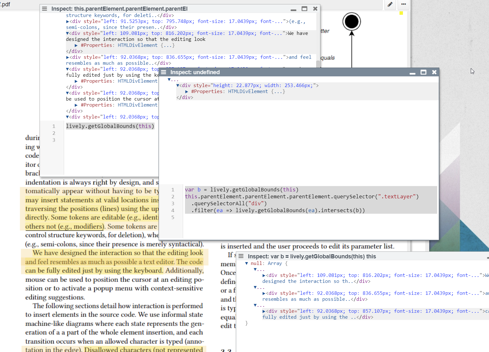
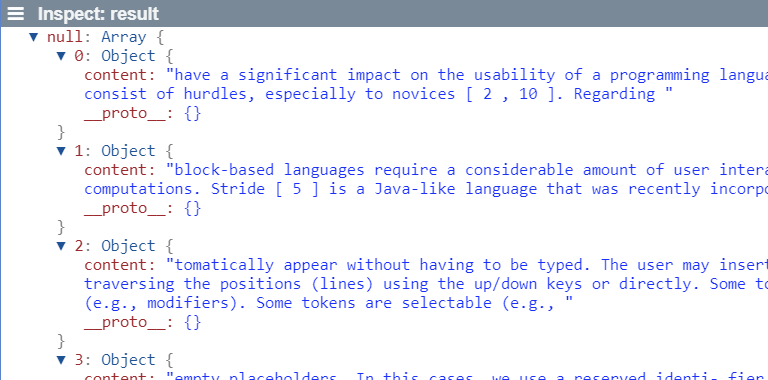

## 2020-02-03 
*Author: @JensLincke*

# #PDF Annotations

I played around with getting the actual text of PDF highlighting.... #ToBeContinued 



```javascript
var b = lively.getClientBounds(this)
this.parentElement.parentElement.parentElement.querySelector(".textLayer")
  .querySelectorAll("div")
  .filter(ea => lively.getClientBounds(ea).intersects(b))
```

And here we go... we are not there yet, but a step further:

```javascript
var view = that.get("#viewerContainer")
var result = []

view.querySelectorAll(".page").forEach(page => {
  var textLayer = page.querySelector(".textLayer")
  var annotations = page.querySelectorAll(".annotationLayer")
  
  annotations.forEach(annotation => {
    var div = annotation.querySelector("div")
    if (!div) return
    var b = lively.getClientBounds(div)
    var jso = {content: ""}
    result.push(jso)
    textLayer.querySelectorAll("div")
      .filter(ea => {
        return lively.getClientBounds(ea).intersects(b)
      })
      .forEach(ea => {
        jso.content += (ea.textContent + " ")
    })    
  })  
})

result
```




# A Linter of Linters

Just a fun fact...

```javascript
import linter from "linter.js"

// (A) works
new linter().foo


// (B) dos not work ... I wonder why ;-)
var linter = new linter()
linter.foo


// (C) this might work
var linter = await System.import("linter.js")
linter = new linter()
linter.foo
```
