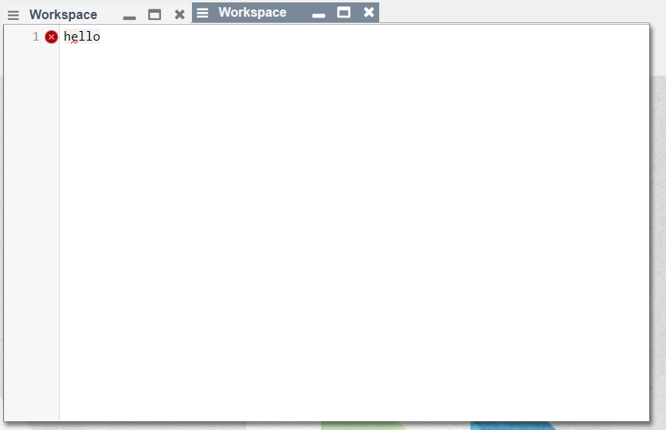
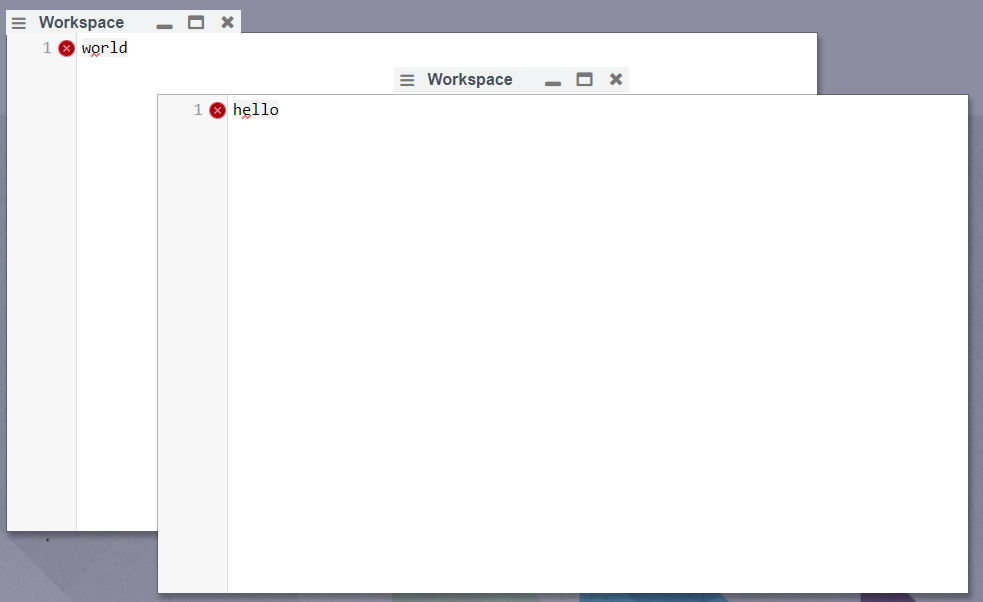
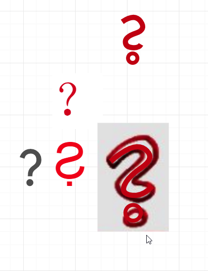

## 2020-02-14
*Author: @JensLincke*


# [BeOS](wikipedia://en/BeOS) Window Experiment

Do we like this Tabs like title bars? They could appear when we drop windows on top each other?


{height=250px} {height=250px}

At the moment it is just a hack... 

```javascript
lively.moveBy(that.get(".window-titlebar"), pt(0,-18))
lively.setExtent(that.get(".window-titlebar"), pt(that.get(".window-title").querySelector("span").getBoundingClientRect().width + 120, 20))
```


## Question Mark with Mirrored S Shape?

Ƨ̣
