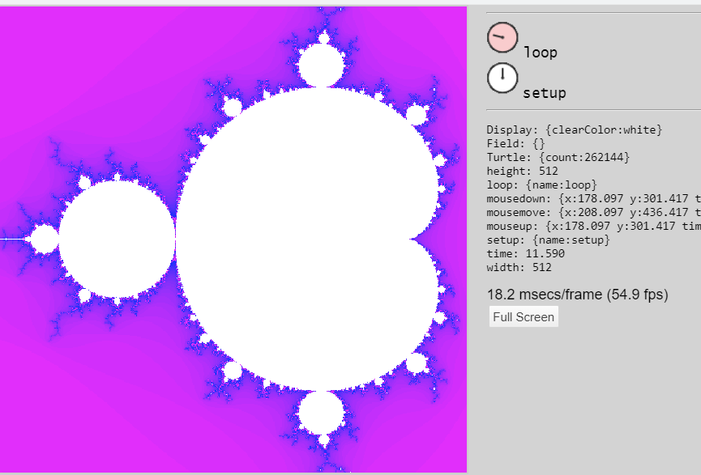

## 2020-03-06 #Shadama
*Author: @JensLincke*

### Found a bug... where does "width" get set?


Instead of:
```javascript
this.env = {};  // {name: value}
```

Using a proxy, one can find such things...
```javascript
  this.env = new Proxy({},  {
    set: function(obj, prop, value) {
      if (prop == "width") {
        debugger
      }
      console.log("ENV["+ prop +"]=" + value)
      obj[prop] = value;
      return true;
    }
  });
```

