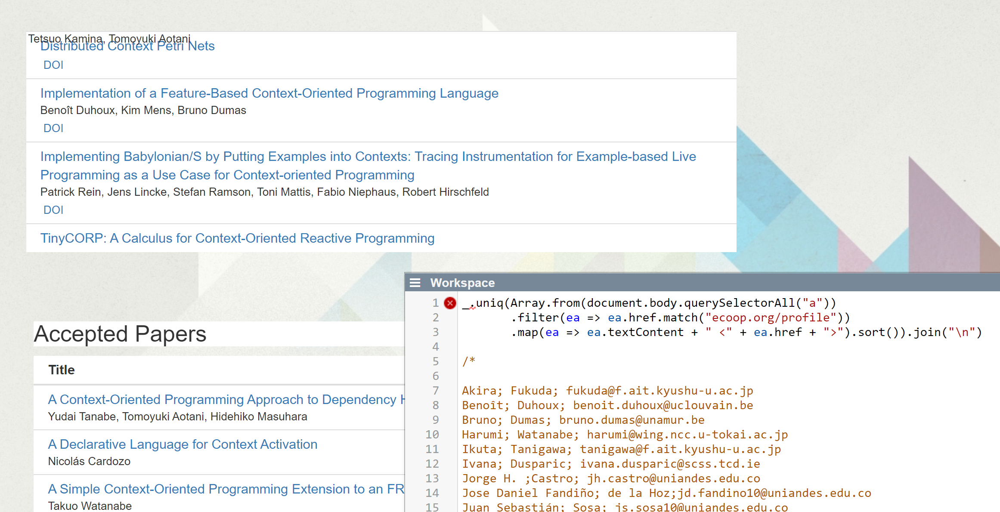

## 2020-03-17
*Author: @onsetsu*

.follow is a scope-based Promise.all!
```js
var p1, p2, resolveMe
var p3 = Promise.follow(async () => {
  p1 = Promise.resolve(42);
  p2 = new Promise(resolve => {
    resolveMe = resolve;
  })
}).then(v => console.log('follow triggered', v))
```

```js
resolveMe()
```
---

## Getting the Authors of last COP Workshops #ThrowawayCode

*Author: @jenslincke*

1. Copy and Paste HTML lists into Lively
2. Map and Filter
3. Go through the resulting URLs and get the Email out of it... or not

```javascript
_.uniq(Array.from(document.body.querySelectorAll("a"))
       .filter(ea => ea.href.match("ecoop.org/profile"))
       .map(ea => ea.textContent + " <" + ea.href + ">").sort()).join("\n") 
```


