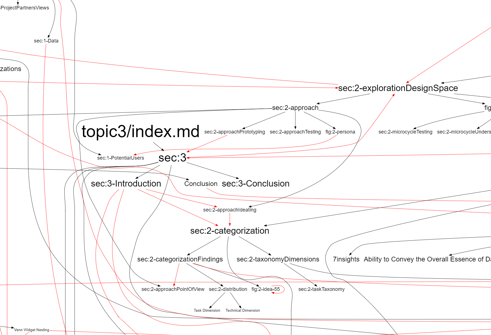

## 2020-08-27 BP2019 Technical Report
*Author: @JensLincke*

First draft of my overview vis for giant BP thesis / Tr: 




### Markdown LaTex issues...


```markdown

\noindent The technical...
```


``` 
\cites{Keim1997VTE}{Keim1996VTM}

does not work yet: [@Keim1997VTE, @Keim1996VTM]

```

```markdown

does NOT  work (yet):


does work:


```