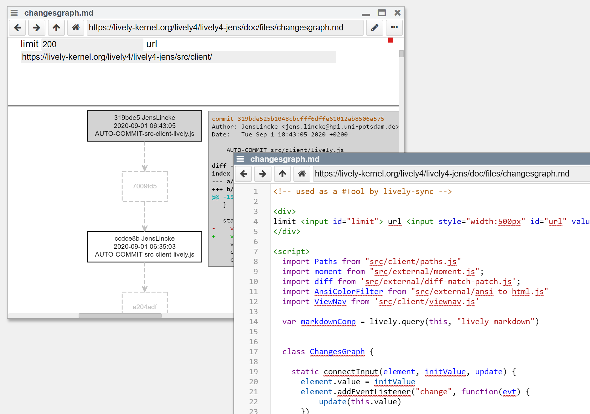
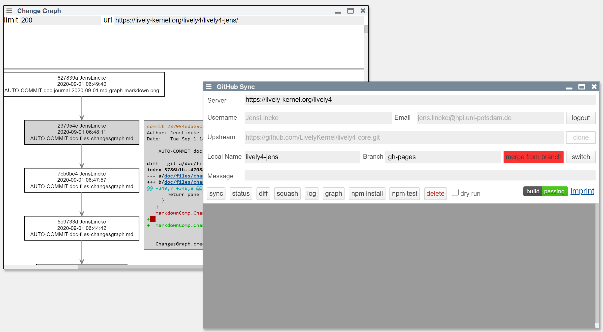

## 2020-09-01 #LiveProgrammingLoop
*Author: @JensLincke*

```javascript
var lastWindow;

(async () => {
  if (lastWindow) lastWindow.remove(); // #LiveProgrammingLoop
  var comp = await lively.openComponentInWindow("lively-markdown") 

  var src = `# hello
 This works:

 <script>
  import moment from "src/external/moment.js";  
 

  moment("1981-06-10").toString()  

 </script>
 `
  
  comp.setContent(src)
  lastWindow = comp.parentElement  
})()
```

## Turning Wiki-pages into Tools ( #PaperIdea )

We used markdown pages to prototype tools and visualizations a lot. But to use it, one had to navigate to that specific page and interact with the tool there. A good and working example of the setup are these journal pages and their index page that allows to create new entries. But markdown pages are not easy to integrate into a workflow with other tools. E.g. using the git graph visualization tool directly from our sync tools is not possible.



With our new `openMarkdown` feature this can now be done.

```javascript
lively.openMarkdown(lively4url + "/doc/files/changesgraph.md", 
  "Change Graph", {url:"https://lively-kernel.org/lively4/lively4-jens/"})
```

This method opens a markdown page directly into it's own window without using the container/browser. The JavaScript world can interact with the markdown with in two ways:

1. Parameters can be passed (here the `url`) and be read by the scripts inside 
2. The `openMarkdown` awaits the execution of all scripts and the resolving of all promised parameters. That way one can wait on active content in the markdown and use it further. 

As an example, we added a button to the repository sync tool. 

