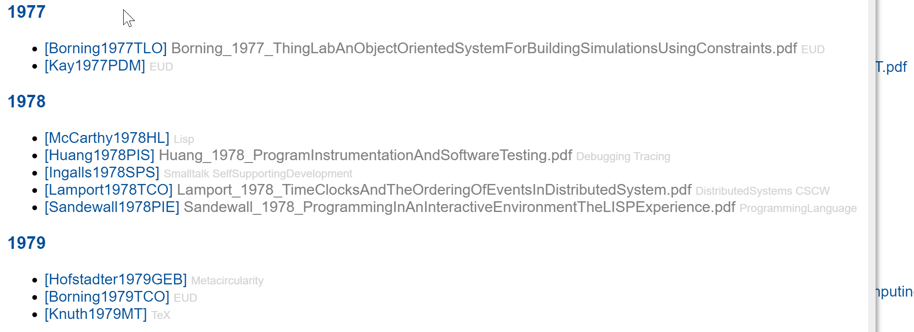
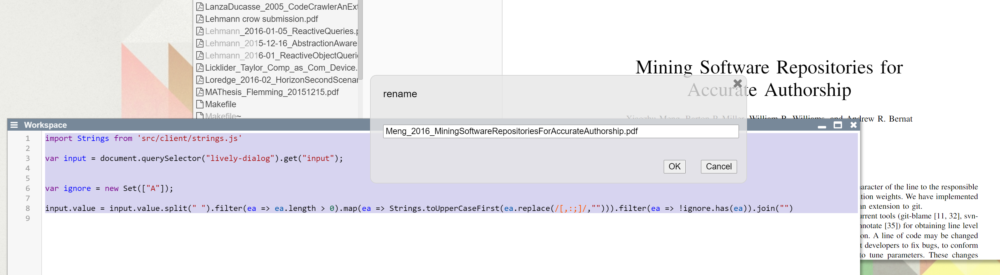

## 2020-09-08 #Lively4Server MOVE allows renaming
*Author: @JensLincke*


So it can be used in scripts.... 

```javascript
fetch("http://localhost:9006/test/b", {
  method: "MOVE",
  headers: {
    destination: "http://localhost:9006/test/c"
  }
}).then(r => r.text())
```

## Some Files Cleanup #Delete

```javascript
var files;
var base = "http://localhost:9005/Dropbox/Thesis/Literature/";
fetch(base, {
  method: "OPTIONS",
  headers: {
    "filelist": true
  }
}).then(r => r.json()).then(obj => files=obj.contents)

var toDelete = files.filter(ea => ea.name.match(/\.note$/)).sortBy(ea => ea.size).filter(ea => ea.size ==  1).map(ea => base + ea.name)

var value;
(async () => {
  for(var ea of toDelete) {
    await fetch(ea, {method: "DELETE"})
    lively.notify("deleted " + ea)
  } 
})()
```

## New Literature Overview Page

Given, that the lively4 FileIndex contains bibliographies and PDF files, those are now printed nicely on <browse://doc/files/literature.md>:



## Script Augmented Interactive Workflows #ScriptingWorkflows

Using Lively it is possible to hook into very manual workflows and start to script. This is similar to the capabilities of AppleScript, but with Halos it is much easier to actually get the elements that contain the interesting content.

```javascript
import Strings from 'src/client/strings.js'

var input = document.querySelector("lively-dialog").get("input");


var ignore = new Set(["A"]);

input.value = input.value.split(" ").filter(ea => ea.length > 0).map(ea => Strings.toUpperCaseFirst(ea.replace(/[,:;]/,""))).filter(ea => !ignore.has(ea)).join("")
```



