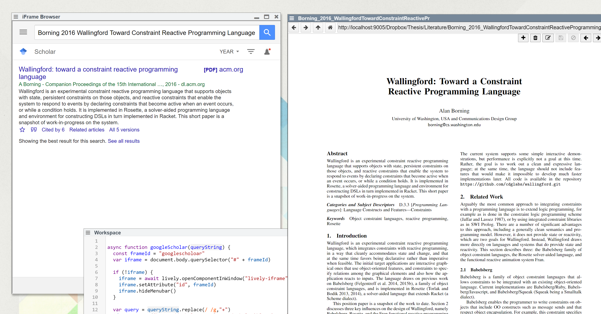

## 2020-09-09
*Author: @JensLincke*

## Browse Google Scholar For current PDF #ScriptingWorkflows



Replacing copy paste into different window. Next stept would be to use Google Scholar API... if there is one. 

An alternative would be the connection of whenever a PDF is browsed the scholar window would notice and show the scholar article to that file. 

```javascript

async function googleScholar(queryString) {
  const frameId = "googlescholoar"
  var iframe = document.body.querySelector("#" + frameId) 
  
  if (!iframe) {
    iframe = await lively.openComponentInWindow("lively-iframe")
    iframe.setAttribute("id", frameId)
    iframe.hideMenubar()
  }
  
  var query = queryString.replace(/ /g,"+")
  iframe.setURL("https://scholar.google.com/scholar?hl=en&as_sdt=0%2C5&btnG=&q=" + query)
  
}

var container = document.body.querySelector("lively-container");
var query = decodeURI(container.getURL().pathname)
  .replace(/.*\//,"")
  .replace(/\.pdf$/,"")
  .replace(/([a-z])([A-Z])/g,"$1 $2")
  .replace(/_/g," ")

googleScholar(query)
```