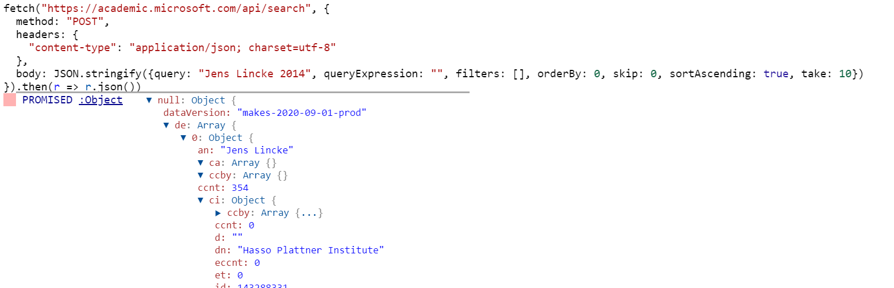

## 2020-09-11
*Author: @JensLincke*

Found it by reverse engineering <https://academic.microsoft.com/>... but maybe it is documented?

```javascript
fetch("https://academic.microsoft.com/api/search", {
  method: "POST",
  headers: {
    "content-type": "application/json; charset=utf-8"
  },
  body: JSON.stringify({query: "Jens Lincke 2014", queryExpression: "", filters: [], orderBy: 0, skip: 0, sortAscending: true, take: 10})
}).then(r => r.json())
```


