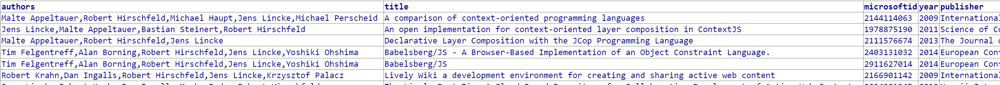
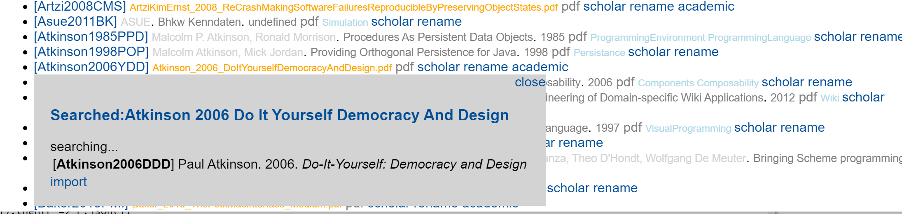
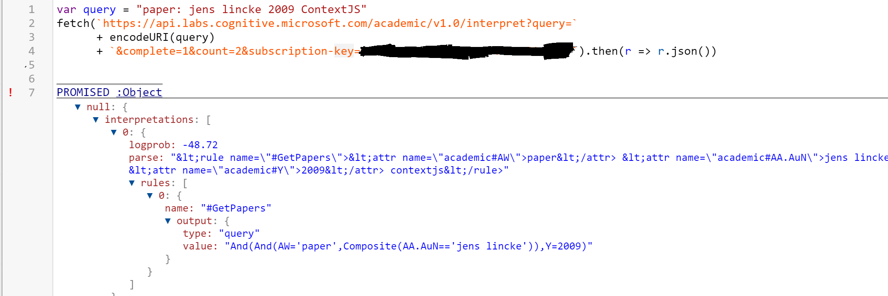

## 2020-09-11 #MicrosoftAcademic for the Win!
*Author: @JensLincke*

Found it by reverse engineering <https://academic.microsoft.com/>... but maybe it is documented?

```javascript
fetch("https://academic.microsoft.com/api/search", {
  method: "POST",
  headers: {
    "content-type": "application/json; charset=utf-8"
  },
  body: JSON.stringify({query: "Jens Lincke 2014", queryExpression: "", filters: [], orderBy: 0, skip: 0, sortAscending: true, take: 10})
}).then(r => r.json())
```


### And here we go

```javascript
import moment from "src/external/moment.js";


var json;

(async () => {
json = await fetch("https://academic.microsoft.com/api/search", {
  method: "POST",
  headers: {
    "content-type": "application/json; charset=utf-8"
  },
  body: JSON.stringify({query: "Jens Lincke", queryExpression: "", filters: [], orderBy: 0, skip: 0, sortAscending: true, take: 10})
}).then(r => r.json())
})()


json.pr.map(ea => ({
  authors: ea.paper.a.map(author => author.dn), 
  title: ea.paper.dn, 
  microsoftid: ea.paper.id, 
  year: moment(ea.paper.v.publishedDate).year(),
  publisher: ea.paper.v.displayName,
  keywords: ea.paper.fos.map(kw => kw.dn),
  abstract: ea.paper.d, 
}))
```







### And with the Proper API

For using the API one needs a key for Project Academic Knowledge: <https://msr-apis.portal.azure-api.net/developer>

There is even a fancy [interpret API](https://docs.microsoft.com/en-us/academic-services/project-academic-knowledge/reference-interpret-method) that will generate the query for you:

```javascript
var query = "paper: jens lincke 2009 ContextJS"
fetch(`https://api.labs.cognitive.microsoft.com/academic/v1.0/interpret?query=`
      + encodeURI(query)
      + `&complete=1&count=2&subscription-key=90...`).then(r => r.json())
```





This specific query can then be evaluated using this [API](https://docs.microsoft.com/en-us/academic-services/project-academic-knowledge/reference-evaluate-method)


