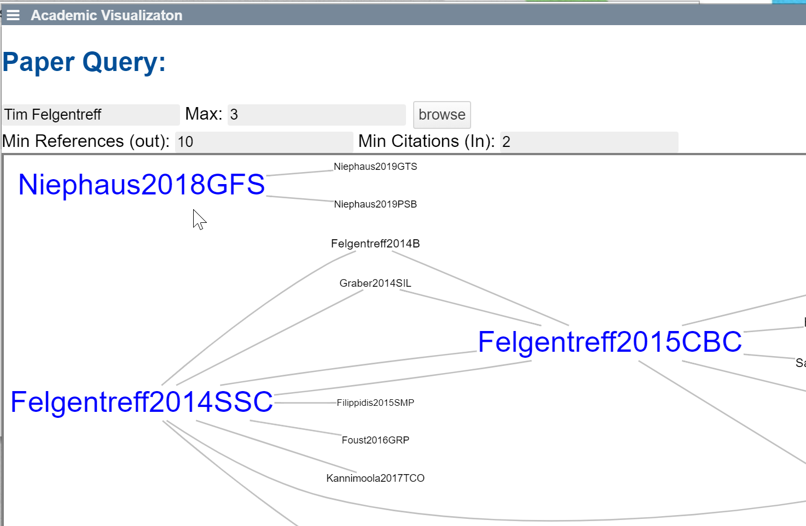

## 2020-10-12 #MarkdownApp
*Author: @JensLincke*


And now we have an app

```javascript
lively.openMarkdown(lively4url + "/demos/visualizations/academic.md", 
      "Academic Visualizaton", {
        query: "Tim Felgentreff",
        "count": 3,
        "min_cc_in": 2,
        "min_refs_out": 10,
})
```

