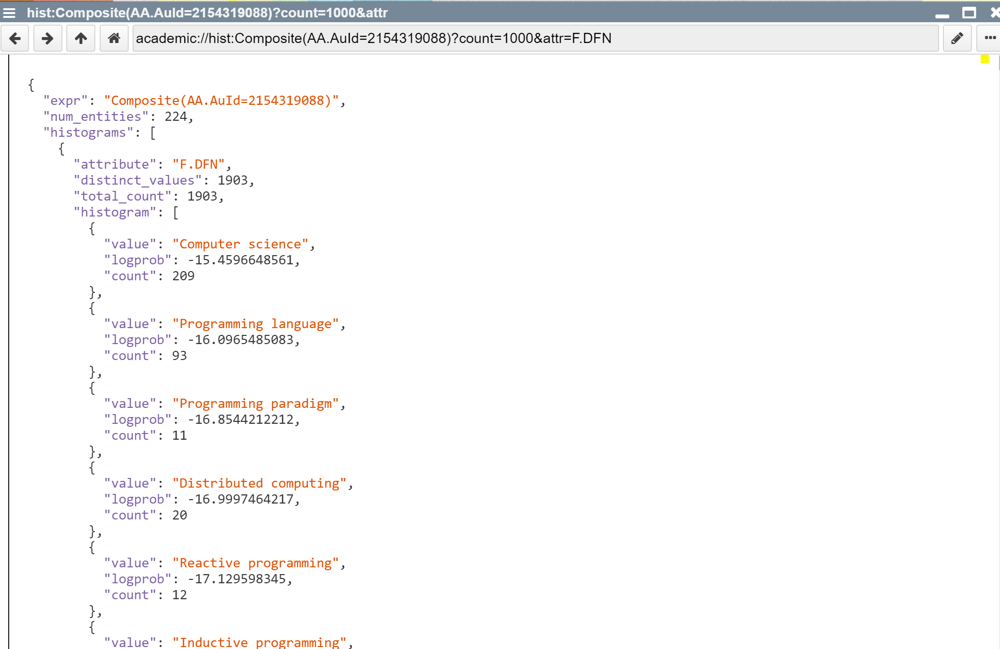

## 2020-10-16
*Author: @JensLincke*

## Microsoft Academics Histograms

Example, the distribution of fields of all our papers:

<academic://hist:Composite(AA.AuId=2154319088)?count=2000&attr=F.DFN>

Our the papers per year:

<academic://hist:Composite(AA.AuId=2154319088)?count=100&attr=Y>

