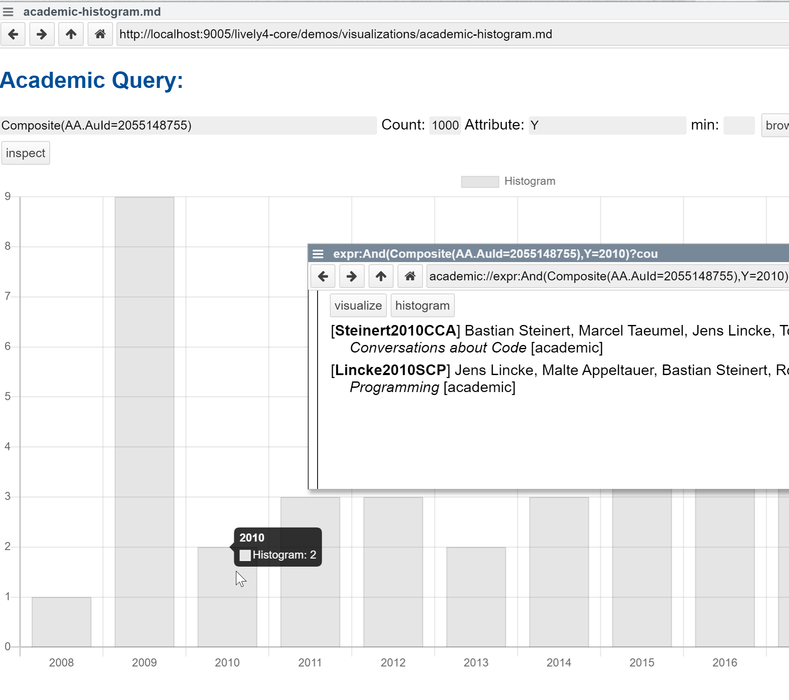

## 2020-10-20
*Author: @JensLincke*

A histogram for `Composite(AA.AuId=2055148755)` and `Y` ... that means all papers of an author per year. Will allow further navigation by click on a bar.

A new query expression will be generated 

<academic://expr:And(Composite(AA.AuId=2055148755),Y=2010)?count=20>

