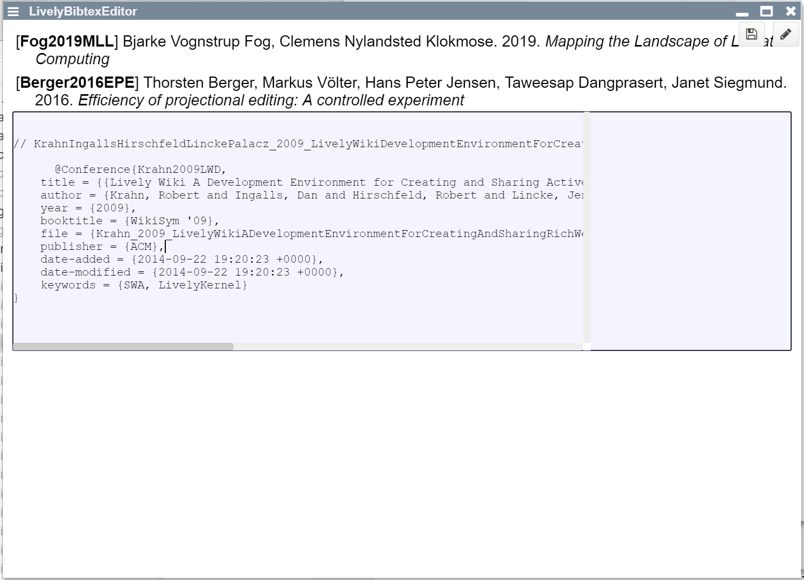

## 2020-10-30 new #Bibtex #Editor
*Author: @JensLincke*

The [new editor](edit://src/components/widgets/lively-bibtex-editor.js) allows changing multiple entries in a table and the editing details of the selected entry.

Changes are indicated with the new #ChangeIndicator

and it will be opened from within the default Bibtex component.

This leads to an interesting setup. There are now [two different views/editors](browse://demos/bibliographie/_incoming.bib) on the view side of the container and then further full source code editing support in the code mirror. 