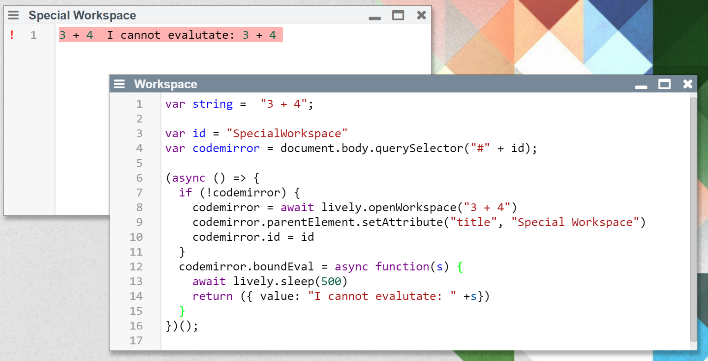

## 2020-11-25 Custom #Workspace
*Author: @JensLincke*


```javascript
var string =  "3 + 4";

var id = "SpecialWorkspace"
var codemirror = document.body.querySelector("#" + id);

(async () => {
  if (!codemirror) {
    codemirror = await lively.openWorkspace("3 + 4")  
    codemirror.parentElement.setAttribute("title", "Special Workspace")
    codemirror.id = id
  }
  codemirror.boundEval = async function(s) {
    await lively.sleep(500)
    return ({ value: "I cannot evalutate: " +s})
  }
})();
```
