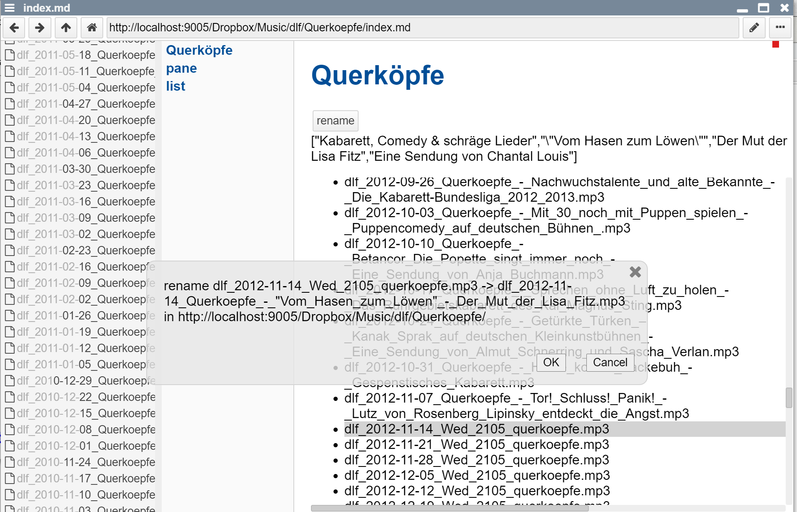

## 2021-02-09 #DLF #Querkoepfe
*Author: @JensLincke*


## #Evolution #MarkdownApp #DirectorySpecificApplication



<http://localhost:9005/Dropbox/Music/dlf/Querkoepfe/index.md>

(INFO: for this application to work, Lively4 does not have to be installed on localhost... Just a lively4 compatible file server, e.g. that can list (OPTIONS), GET, PUT, DELETE, and optionally MOVE files). In webwerkstatt (Lively2) we used apache webdav for it... our current protocol is custom.

An evening of scripting looked like this....


| filename| date| user | host | size|
|-------|---|--|---|--|
| index.md | 22:10 | Bearbeitet von Jens Lincke | Desktop | 3,71 KB |
| index.md | 22:01 | Bearbeitet von Jens Lincke | Desktop | 3,68 KB |
| index.md | 21:56 | Bearbeitet von Jens Lincke | Desktop | 3,52 KB |
| index.md | 21:54 | Bearbeitet von Jens Lincke | Desktop | 3,36 KB |
| index.md | 21:51 | Bearbeitet von Jens Lincke | Desktop | 3,3 KB |
| index.md | 21:48 | Bearbeitet von Jens Lincke | Desktop | 3,11 KB |
| index.md | 21:47 | Bearbeitet von Jens Lincke | Desktop | 3,12 KB |
| index.md | 21:43 | Bearbeitet von Jens Lincke | Desktop | 2,85 KB |
| index.md | 21:42 | Bearbeitet von Jens Lincke | Desktop | 2,75 KB |
| index.md | 21:40 | Bearbeitet von Jens Lincke | Desktop | 2,65 KB |
| index.md | 21:33 | Bearbeitet von Jens Lincke | Desktop | 2,48 KB |
| index.md | 21:30 | Bearbeitet von Jens Lincke | Desktop | 2,3 KB |
| index.md | 21:29 | Bearbeitet von Jens Lincke | Desktop | 2,3 KB |
| index.md | 21:19 | Bearbeitet von Jens Lincke | Desktop | 1,8 KB |
| index.md | 21:17 | Bearbeitet von Jens Lincke | Desktop | 1,29 KB |
| index.md | 21:15 | Bearbeitet von Jens Lincke | Desktop | 1,08 KB |
| index.md | 21:14 | Bearbeitet von Jens Lincke | Desktop | 1,13 KB |
| index.md | 21:12 | Bearbeitet von Jens Lincke | Desktop | 1,09 KB |
| index.md | 21:08 | Bearbeitet von Jens Lincke | Desktop | 1.011 Bytes |
| index.md | 21:06 | Bearbeitet von Jens Lincke | Desktop | 787 Bytes |
| index.md | 21:04 | Bearbeitet von Jens Lincke | Desktop | 477 Bytes |
| index.md | 21:01 | Bearbeitet von Jens Lincke | Desktop | 256 Bytes |
| index.md | 20:59 | Bearbeitet von Jens Lincke | Desktop | 185 Bytes |
| index.md | 20:57 | Hinzugefügt von Jens Lincke | Desktop | 15 Bytes |


### Starting from a simple listing of files


```javascript
var container = lively.query(this, "lively-container") var dirURL = container.getDir()

var stats

(async () => { stats = await fetch(dirURL, {method: "OPTIONS"}).then(r => r.json())

return stats.contents })()
```

### ... the script evolved in a bit over an hour into 

```javascript

import Strings from 'src/client/strings.js'

class QuerkoepfeApp {

  constructor(dirURL) {
    this.dirURL = dirURL
  }
  
  
  async loadDLFQuerkoepfe(isoDate) {
    var tab = await fetch(`http://localhost:9005/Dropbox/share/DLF/extract/${isoDate}.tab`).then(r => r.text()) 

    var programm = tab.split(/\n/g).map(ea => ea.split(/\t/))

    var querkoepfe = programm.filter(ea => ea[1] && ea[1].startsWith("Querköpfe"))[0]

    programm.map(ea => ea[0])


    if (!querkoepfe || !querkoepfe[2]) return
    
    var div = <div></div>
    div.innerHTML = querkoepfe[2]
    div.querySelector("p").innerHTML.split(/<br>/)
    return div.querySelector("p").innerHTML.split(/<br>/)

  }
  
  
  
  async selectItem(item) {
    if (this.lastSelected) this.lastSelected.classList.remove("selected")
    item.classList.add("selected")
    this.lastSelected = item
    
    
    var m = item.textContent.match(/(20\d\d-\d\d-\d\d)/)
    if (m) {
      var isoDate = m[1]
    } else {
      return
    }
    
    var info = await this.loadDLFQuerkoepfe(isoDate)
    
    if (!info) {
      this.details.innerHTML = "no details"
    } else {
      this.details.innerHTML = JSON.stringify(info)
      this.lastSelected.info = info
    }
    
  }

  onItemClick(evt, item) {
    
    this.selectItem(item)
      
    // if (item.classList.contains("selected")) {
    //   item.classList.remove("selected")
    // } else {
    //   item.classList.add("selected")
    // }
  }
  
  async onRenameButton(evt) {
    if (!this.lastSelected || !this.lastSelected.info) return
    if (!this.lastSelected.file) return
    
    var rawPattern = "Wed_2105_querkoepfe"
    
    var filename = this.lastSelected.file.name
    if (!filename.match(rawPattern)) {
      lively.notify("file has already a custom name")
      return
    }
    
    
    var info = this.lastSelected.info
    var s ="Querkoepfe - " + info[1]
    if (info[2]) s += " - " + info[2]
    s = s.replace(/ /g, "_")
    s = s.replace(/[:.\/]/g, "_")

    s = s.replace(/_+/g, "_")

    var newFilename = filename.replace(rawPattern, s)
  
    var fromURL = this.dirURL + encodeURI(filename)
    var toURL = this.dirURL + encodeURI(newFilename)


    await lively.confirm("rename " + filename + " -> " + newFilename  + " in " + this.dirURL)
  
  
    var resp = await lively.files.moveFile(fromURL, toURL)
    if (resp.status == 200) {
      this.lastSelected.innerHTML = newFilename
    } else {
      this.lastSelected.style.backgroundColor = "red"
    }
  
    // lively.warn("not implemented yet")
    
  }
  async createView() {
    var stats = await fetch(this.dirURL, {method: "OPTIONS"}).then(r => r.json())


    var items = stats.contents
                  .sortBy(ea => ea.name)
                  .map(ea => {
                    var item = <li>{ea.name}</li>
                    item.file = ea
                    item.addEventListener("click", evt => this.onItemClick(evt, item))
                    return item
                  })

    var list = <ul id="list">{...items}</ul>
    var style = document.createElement("style") // #ISSUE style tags conflict with Markdown rewriting....
    style.innerHTML = `
      li.selected {
        background-color: lightgray
      }
      
      #pane {
        height: 100%;
      }
      
      #list {
        height: 400px;
        overflow: auto;
      }
      
    `
    this.details = <div id="details"></div>
    return <div>
        {style}
        <div id="pane">
          <div id="buttons"><button click={evt => this.onRenameButton(evt)}>rename</button></div>
          {this.details}
          {list}
        </div>
      </div>  
  }

}


var container  = lively.query(this, "lively-container")
new QuerkoepfeApp(container.getDir()).createView()

```

I knew [the domain](https://lively-kernel.org/repository/webwerkstatt/users/jenslincke/DLF.xhtml), programmed similar applications before and could look at existing scripts when I ran into an issue with renaming umlauts. But this the (yet unpolished) typical kind of application I expect Lively4 users to build. Some parts of the overall application is handled outside of lively, e.g. the recording of the radio show and the downloading (and parsing) of the radio program and information. Since both approaches are long running and require full web access. Downloading and scraping other websites would is prevented by the browser and requires Lively additional help from a proxy server or in this case a shell script. 

The resulting Lively4 is a markdown file that is persisted beside the data (mp3 files) it works on. When browsing the directory of the files within lively will show "index.md" file and run the application. In a funny way, this is a context specific application inside a directory... I think Windows Explorer experimented with such "Active Desktop" in the 90ies... But the time was not right yet and everybody hated it, because it slowed down the computer. And I assume was a huge security risk. Which might be the same for this application... 


