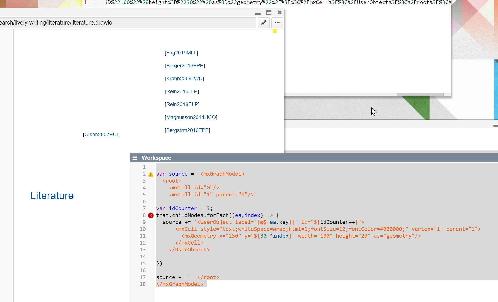

## 2021-02-24 #draw.io
*Author: @JensLincke*




### Reverse Engineering

Copy some drawio content and paste it into a workspace...

```javascript
import XML from "src/client/xml.js"

lively.get("#drawiosource").value = XML.prettify(decodeURIComponent(
lively.get("#drawiocode").value))
```

That produces some source... and copy and pasting it back into drawio produced actual graphical content. 

```javascript
<mxGraphModel>
  <root>
    <mxCell id="0"/>
    <mxCell id="1" parent="0"/>
    <UserObject label="[@Olsen2007EUI]" id="2">
      <mxCell style="text;whiteSpace=wrap;html=1;fontSize=12;fontColor=#000000;" vertex="1" parent="1">
        <mxGeometry x="240" y="220" width="100" height="30" as="geometry"/>
      </mxCell>
    </UserObject>
    <UserObject label="[@Hoho]" id="3">
      <mxCell style="text;whiteSpace=wrap;html=1;fontSize=12;fontColor=#000000;" vertex="1" parent="1">
        <mxGeometry x="250" y="270" width="100" height="30" as="geometry"/>
      </mxCell>
    </UserObject>
  </root>
</mxGraphModel>
```

### Generating Draw.io Content

So, we can actually generate content


```javascript

var source = `<mxGraphModel>
  <root>
    <mxCell id="0"/>
    <mxCell id="1" parent="0"/>`

var idCounter = 3;
that.childNodes.forEach((ea,index) => {
  source += `<UserObject label="[@${ea.key}] ${ea.getAuthors()[0]} ${ea.year}. ${ea.title} " id="${idCounter++}">
      <mxCell style="text;whiteSpace=wrap;html=1;fontSize=12;fontColor=#000000;" vertex="1" parent="1">
        <mxGeometry x="250" y="${30 *index}" width="600" height="40" as="geometry"/>
      </mxCell>
    </UserObject>`
  
})

source += `  </root>
</mxGraphModel>`


```