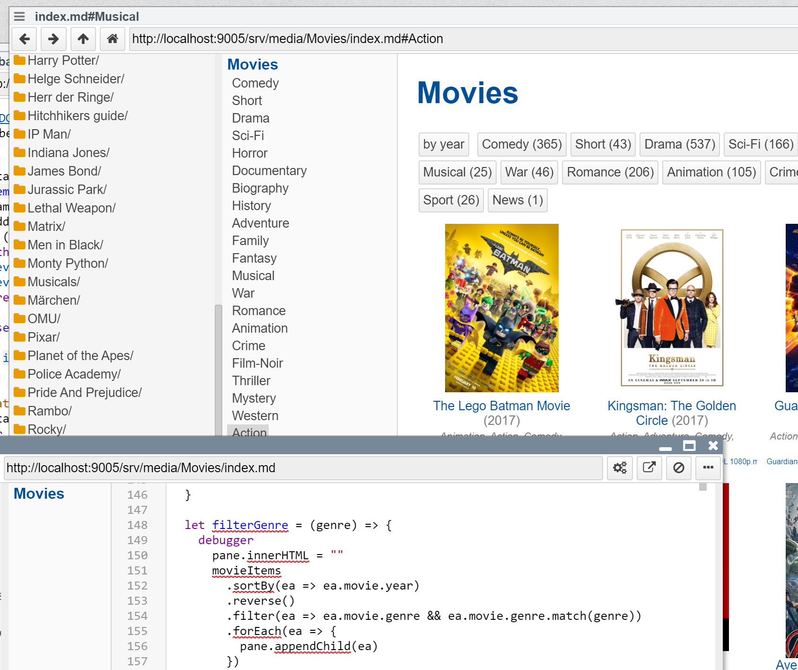

## 2021-03-18 #CustomNavbarItems
*Author: @JensLincke*




And just for backups... the markdown app in my local movie dir.

```javascript
# Movies


<script>

var container = lively.query(this, "lively-container");
import ContextMenu from 'src/client/contextmenu.js';

(async () => {
  var dir = container.getDir()
  
  // "cached://" +
  var listSource = await fetch( dir + "/movies.jsonl").then(r => r.text())
  
  var files  = listSource.split("\n").map(ea => {
    try {
      return JSON.parse(ea)
    } catch(e) {
      return null
    }
  }).filter(ea => ea)
  
  
  var movies = files
      .filter(ea => ea.imdb)
      .map(ea => ea.imdb)
      .uniq().map(ea => {
        var all =files.filter(file => file.imdb == ea)
        var first = all[0]
        first.files = all
        return first
      })
      .filter(ea => ea.year)
      
  var genres = new Map()
  for(let movie of movies) {
    for(let genre of (movie.genre || "").split(/, /)) {
      var bag = genres.get(genre) || []
      bag.push(movie)
      genres.set(genre, bag)
    }
  }
  
  let serverURL = lively.files.serverURL(dir)
        // does only make sense when accessing a localhost server, 
        // otherwise a pdf viewer would be opened on a remote machine?
       
  var style = document.createElement("style")
  style.textContent = `
    .poster img {
      width: 120px;
    }
    .poster {
      height: 185px;
      overflow: hidden;
    }
    
    .movie {
      font-size: 10pt;
      text-align: center;
      padding: 10px;
      width: 160px;
      height: 250px;
      display: inline-block;
      overflow: hidden;
    }
    
    .year {
      color: gray;
    }
    
    .genre {
      color: gray;
      font-style: italic;
      font-size:8pt;
    }
    .file {
      font-size:6pt;
      white-space: nowrap;
    }
    
  `
  let playFile = (file) => {
    var url = dir + "/"+ encodeURI(file.filename)
    let playPath = url.replace(serverURL,"").replace(/^\//,"")
    var openURL = serverURL + "/_open/" + playPath 
    lively.notify("open " + openURL)
    fetch(openURL)
  }
  
  
  var movieItems = movies.map(movie => {
      var title = <a class="title" click={() => {
          lively.openInspector(movie)
        }}></a>
      title.innerHTML = movie.files[0].title // contains HTML
      
      var item =  <div class="movie">
        <div class="poster">
         window.open("https://www.imdb.com/title/" + movie.imdb)}
        ></img>
        </div>
        {title} 
        <span class="year">({movie.files[0].year})</span> 
        <br />
        <span class="genre">{movie.files[0].genre || ""}</span>
        {... movie.files.map(file => {
          var fileItem = <div class="file"><a click={() => {
            playFile(file)
          }}>{file.filename.replace(/.*\//,"")}</a></div>
          fileItem.addEventListener('contextmenu',  evt => {
            if (!evt.shiftKey) {
              evt.stopPropagation();
              evt.preventDefault();
              var menu = new ContextMenu(fileItem, [
                    ["open", () => playFile(file)],
                  ]);
              menu.openIn(document.body, evt, fileItem);
              return true;
            }

          }, false);
        
          return fileItem
        
        })}
      </div>
      
      item.movie = movie
      return item
    });
    
    
  let pane = <div class="movies">
    {...movieItems}
    </div>
  

  let sortByYear = () => {
      pane.innerHTML = ""
      movieItems.sortBy(ea => ea.movie.year).reverse().forEach(ea => {
        pane.appendChild(ea)
      })
  
  }
  
  let filterGenre = (genre) => {
    debugger
      pane.innerHTML = ""
      movieItems
        .sortBy(ea => ea.movie.year)
        .reverse()
        .filter(ea => ea.movie.genre && ea.movie.genre.match(genre))
        .forEach(ea => {
          pane.appendChild(ea)
        })
  }
  var navbar = container.get("lively-container-navbar")
  var navbarDetails = navbar.get("#details")
    
  let createGenreButton = (genre) => {
    var bag = genres.get(genre)
    
    var detailsItem = navbar.createDetailsItem(genre)
    detailsItem.classList.add("subitem")
    detailsItem.classList.add("level2")
    navbarDetails.querySelector("ul").appendChild(detailsItem)
    detailsItem.addEventListener("click", () => filterGenre(genre))

    return <button click={() => filterGenre(genre)}>{genre} ({bag.length})</button>
  }
    
  
  return <div>
    {style}
    <div>
      <button click={() => sortByYear()}>by year</button>
      {...Array.from(genres.keys()).map(genre => createGenreButton(genre))}
    </div>
    {pane}
  </div>
})()


</script>
```


