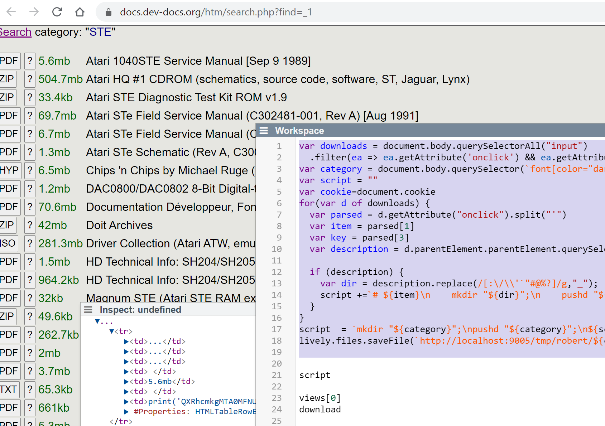
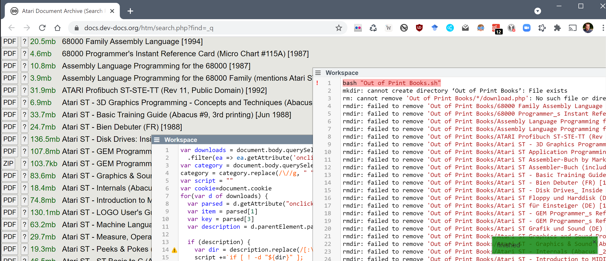

## 2021-03-29
*Author: @JensLincke*

# Lively4Loader

Some lively scripting on a web page

```javascript
var downloads = document.body.querySelectorAll("input")
  .filter(ea => ea.getAttribute('onclick') && ea.getAttribute('onclick').match("download"))
var category = document.body.querySelector(`font[color="darkblue"]`).textContent
var script = ""
var cookie=document.cookie
for(var d of downloads) {
  var parsed = d.getAttribute("onclick").split("'")
  var item = parsed[1]
  var key = parsed[3]
  var description = d.parentElement.parentElement.querySelector(`font[color="black"]`).childNodes[1].textContent
  
  if (description) {
    var dir = description.replace(/[:\/\\'`"#@%?]/g,"_");
    script +=`# ${item}\n    mkdir "${dir}";\n    pushd "${dir}";\n    curl -X POST -b "${cookie}" -O -J -F item='${item}' -F key='${key}' -F click=1 https://docs.dev-docs.org/htm/download.php;\n    popd;\n`  
  }
}
script  = `mkdir "${category}";\npushd "${category}";\n${script};\n    popd` 
lively.files.saveFile(`http://localhost:9005/tmp/robert/${category}.sh`, script)
```




## Fuck, I lost some valuable progress... 

because scripting on lively auto saved desktop is not versioned... and I had multiple tabs open... and closed an old one after a new one... the old one has overridden the new content :/

This is what I got... but there was some fancy Makefile, and auto reloading logic that evolved on that page that is now lost.

So let's recreate it.

```javascript
var downloads = document.body.querySelectorAll("input")
  .filter(ea => ea.getAttribute('onclick') && ea.getAttribute('onclick').match("download"))
var category = document.body.querySelector(`font[color="darkblue"]`).textContent
var script = ""
var cookie=document.cookie
for(var d of downloads) {
  var parsed = d.getAttribute("onclick").split("'")
  var item = parsed[1]
  var key = parsed[3]
  var description = d.parentElement.parentElement.querySelector(`font[color="black"]`).childNodes[1].textContent
  
  if (description) {
    var dir = description.replace(/[:\/\\'`"#@%?]/g,"_");
    script +=`if [ ! -d "${dir}" ]; 
  then mkdir "${dir}";
    pushd "${dir}";
    curl -X POST -b "${cookie}" -O -J -F item='${item}' -F key='${key}' -F click=1 https://docs.dev-docs.org/htm/download.php;
    popd;
  else 
    echo "skip ${dir}"; 
  fi
`   
  }
}
script  = `
mkdir "${category}"
rm "${category}"/*/download.php 
rmdir "${category}"/*
pushd "${category}"
${script}
popd` ;


(async () => {
  await lively.files.saveFile(`http://localhost:9005/tmp/robert/${category}.sh`, script)
  var makefile = `
all:
\t\tbash "${category}.sh"
  
`
  await lively.files.saveFile(`http://localhost:9005/tmp/robert/Makefile`, makefile)
  var buildPath = "tmp/robert/"
  var serverURL = "http://localhost:9005"
  var makeURL = serverURL + "/_make/" + buildPath 

  document.body.querySelector("#log").value = "run script"
  var result = await fetch(makeURL, {}).then(r => r.text())
  document.body.querySelector("#log").value = result
  if (result.match("% Total    % Received")) {
    lively.warn("not finished yet")
    await lively.sleep(1000)
    location.reload()
  } else {
    lively.success("finished")
  }
})()

document.cookie.replace(/(?<=^|;).+?(?=\=|;|$)/g, name => location.hostname.split('.').reverse().reduce(domain => (domain=domain.replace(/^\.?[^.]+/, ''),document.cookie=`${name}=;max-age=0;path=/;domain=${domain}`,domain), location.hostname));

```

A specialty of the workspace is that it executes itself on page load automatically, by attaching a lively-script to its parent window. 
```javascript
function livelyLoad() {
  lively.sleep(1000).then(() => {
    this.target.boundEval(this.target.value)
  })
}
```

And it triggers a page reload with `location.reload()` that way it keeps executing across page reloads, allowing the page to get new cookies and generate and execute new download scripts until the downloads are finished. The whole mess could be replaced be getting the fresh cookie and extracting items, keys, and descriptions on the command line. But for this one-time-script it is not worth it... and the downloads are automated enough. 


