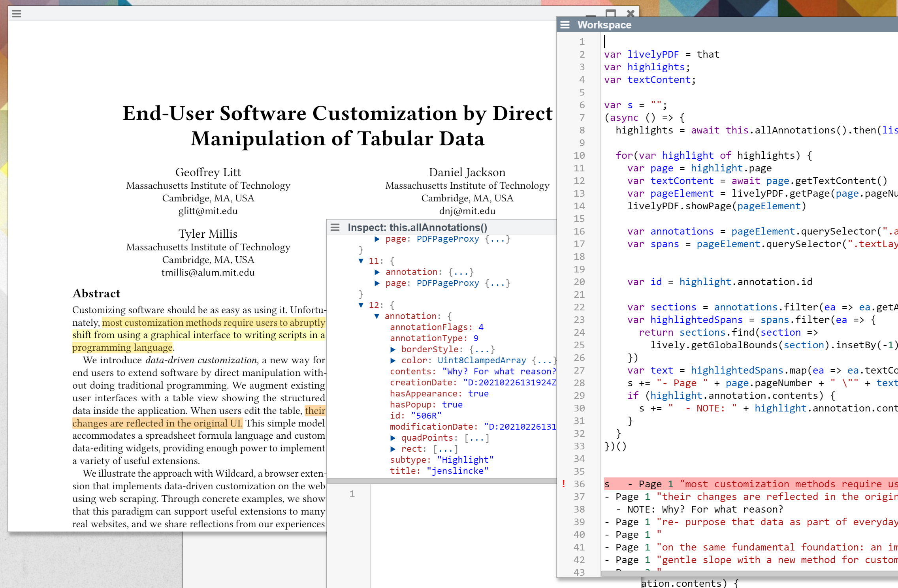
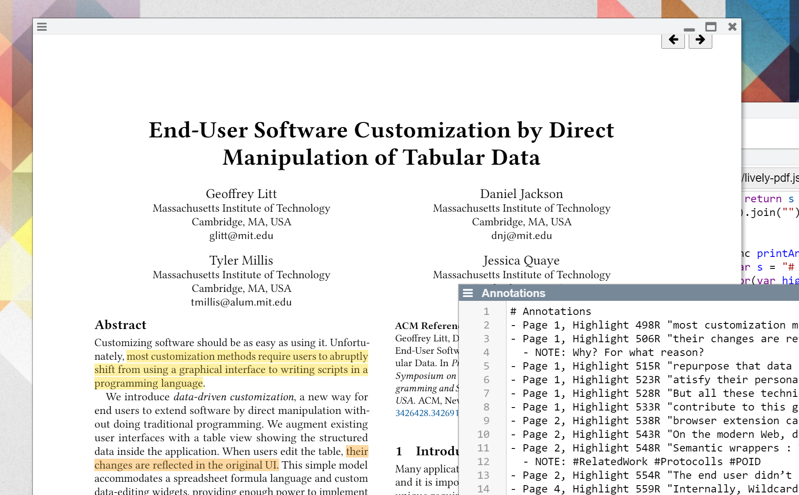

## 2021-04-28 #PDF #Annotations #Extraction
*Author: @JensLincke*


It works! 



```javascript

var livelyPDF = that
var highlights;
var textContent;

var s = "";
(async () => {
  highlights = await this.allAnnotations().then(list => list.filter(ea => ea.annotation.subtype == "Highlight"))
  
  for(var highlight of highlights) {
    var page = highlight.page
    var textContent = await page.getTextContent()
    var pageElement = livelyPDF.getPage(page.pageNumber)
    livelyPDF.showPage(pageElement)
    
    var annotations = pageElement.querySelector(".annotationLayer").querySelectorAll("section")
    var spans = pageElement.querySelector(".textLayer").querySelectorAll("span")
    
    
    var id = highlight.annotation.id

    var sections = annotations.filter(ea => ea.getAttribute('data-annotation-id') == id)
    var highlightedSpans = spans.filter(ea => {
      return sections.find(section => 
        lively.getGlobalBounds(section).insetBy(-1).containsRect(lively.getGlobalBounds(ea)))
    })
    var text = highlightedSpans.map(ea => ea.textContent).join(" ")
    s += "- Page " + page.pageNumber + " \"" + text+"\n"
    if (highlight.annotation.contents) {
      s += "  - NOTE: " + highlight.annotation.contents + "\n"
    }
  }
})()
s   
```

And we get the result

```
- Page 1 "most customization methods require users to abruptly programming
- Page 1 "their changes are reflected in the original UI.
  - NOTE: Why? For what reason? 
- Page 1 "re- purpose that data as part of everyday software
- Page 1 "
- Page 1 "on the same fundamental foundation: an imperative pro- gramming model, with statements, mutable variables, and loops.
- Page 1 "gentle slope with a new method for customizing software via direct manipulation, taking inspiration from visual database
- Page 2 "
- Page 2 "data is often stored in proprietary silos, limiting the agency of users to choose their applications and flexi-
- Page 2 "Semantic wrappers : Typically, tools that don’t rely on official extension APIs resort to offering low-level APIs for customization. Instead, we propose a community- maintained library of semantic wrappers around ex- isting applications, enabling end users to work with domain data rather than low-level representations.
  - NOTE: #RelatedWork #Protocolls #POID
- Page 2 "any work to create this table, because a programmer previ- ously created an adapter to extract data from this particular website, and contributed it to a shared library of adapters
- Page 4 "the webpage’s DOM to synchronize it with the sort order of the table. This sort predicate is also persisted in the browser and reapplied automatically the next time the user loads the page, so they can always browse the page sorted by points.
- Page 4 "display the contents of this new column in the original page
- Page 4 "They can then filter the table to only contain rows where this formula column contains false
- Page 4 "original website could not have implemented, since websites don’t have access to the browser history for privacy rea-
- Page 4 "This scenario has shown a few examples of how data- driven customizations empower a user to improve their ex-
- Page 4 "article is scraped from the web page DOM, and user annota- tions are loaded from the brower’s local storage.
- Page 5 "
  - NOTE: How are the two tables joined? How is a stable identifier identified?
- Page 5 "query engine has joined the two tables together by a shared ID column, and sorted the result by the points column.
```

## And it's a new feature!

<edit://src/components/widgets/lively-pdf.js#printAnnotations>



We even could overcome the problem of marking text sections that are represented as a whole `span` tag. The solution was to split the span tag into many pieces, each containing only one character. 

So the overall algorithm looks like this.

- let the whole pdf render... 
- split up big chunged spans into little ones and insert some spaces where it makes sense
- get all annotations from the pdfDocument
  - those contain the "contents" and geometry of highlights, (but not the *highlighted content*)
- take only the interesting ones, e.g. highlights
- for each annotation find the rendered html `sections` by using the id
- then compare the global bounds of each attribute section with each span char and gather the contained ones
  - give the bounds some wiggle room
- concatenate the characters into a string
- cleanup the string to some degree, e.g. fix our own spaces mess 
- create a document that contains highlighted text and its associated notes

```
# Annotations
- Page 1, Highlight 498R "most customization methods require users to abruptly shift from using a graphical interface to writing scripts in aprogramming language."
- Page 1, Highlight 506R "their changes are reflected in the original UI."
  - NOTE: Why? For what reason? 
- Page 1, Highlight 515R "repurpose that data as part of everyday software usage."
- Page 1, Highlight 523R "atisfy their personal goals."
- Page 1, Highlight 528R "But all these techniques build on the same fundamental foundation: an imperative programming model, with statements, mutable variables, and loops."
- Page 1, Highlight 533R "contribute to this gentle slope with a new method for customizing software via direct manipulation, taking inspiration from visual database query interfaces and spreadsheets,"
- Page 2, Highlight 538R "browser extension called Wildcard"
- Page 2, Highlight 543R "On the modern Web, data is often stored in proprietary silos, limiting the agency of users to choose their applications and flexibly work with data."
- Page 2, Highlight 548R "Semantic wrappers : Typically, tools that don’t rely on official extension APIs resort to offering low-level APIs for customization. Instead, we propose a communitymaintained library of semantic wrappers around ex- isting applications, enabling end users to work with domain data rather than low-level representations."
  - NOTE: #RelatedWork #Protocolls #POID
- Page 2, Highlight 554R "The end user didn’t need to do any work to create this table, because a programmer previously created an adapter to extract data from this particular website, and contributed it to a shared library of adapters integrated into Wildcar"
- Page 4, Highlight 559R "Internally, Wildcard has changed the webpage’s DOM to synchronize it with the sort order of the table. This sort predicate is also persisted in the browser and reapplied automatically the next time the user loads the page, so they can always browse the page sorted by points."
- Page 4, Highlight 564R "the user clicks a menu option in the table header to display the contents of this new column in the original page"
- Page 4, Highlight 569R "They can then filter the table to only contain rows where this formula column contains false;"
- Page 4, Highlight 574R "This is an example of a customization that the original website could not have implemented, since websites don’t have access to the browser history for privacy reasons."
- Page 4, Highlight 582R "This scenario has shown a few examples of how datadriven customizations empower a user to improve their ex- perience of a website."
- Page 4, Highlight 590R "The name and points value for each article is scraped from the web page DOM, and user annotations are loaded from the brower’s local storage."
- Page 5, Highlight 595R "The two tables are then combined into a single table"
  - NOTE: How are the two tables joined? How is a stable identifier identified?
- Page 5, Highlight 601R "In this example, the query engine has joined the two tables together by a shared ID column, and sorted the result by the points column."
```
