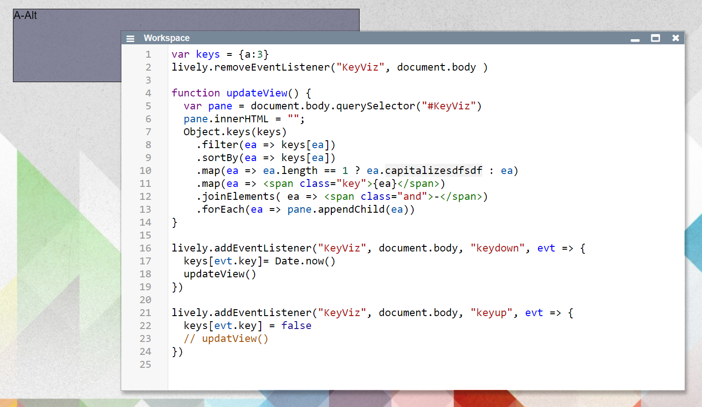

## 2021-04-30 #KeyeventDisplay
*Author: @JensLincke*


I came up with the need for this:




And then I made it into a component <edit://src/components/widgets/keyevent-display.js> and it looks like this in action:

Video: [async-doit-in-workspace](https://lively-kernel.org/lively4/media/videos/210430_lively4-async-doit-in-workspace.mp4)


## Appendix


```javascript
var keys = {a:3}
lively.removeEventListener("KeyViz", document.body )

function updateView() {
  var pane = document.body.querySelector("#KeyViz")
  pane.innerHTML = "";
  Object.keys(keys)
    .filter(ea => keys[ea])
    .sortBy(ea => keys[ea])
    .map(ea => ea.length == 1 ? ea.capitalizesdfsdf : ea)
    .map(ea => <span class="key">{ea}</span>)
    .joinElements( ea => <span class="and">-</span>)
    .forEach(ea => pane.appendChild(ea))
}

lively.addEventListener("KeyViz", document.body, "keydown", evt => {
  keys[evt.key]= Date.now()
  updateView()
})
           
lively.addEventListener("KeyViz", document.body, "keyup", evt => {
  keys[evt.key] = false
  // updatView()
})
```


