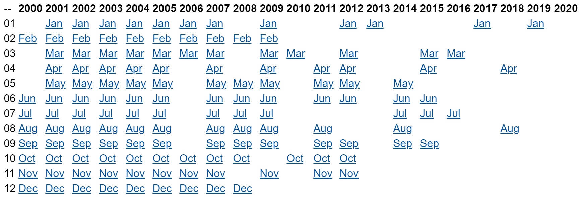
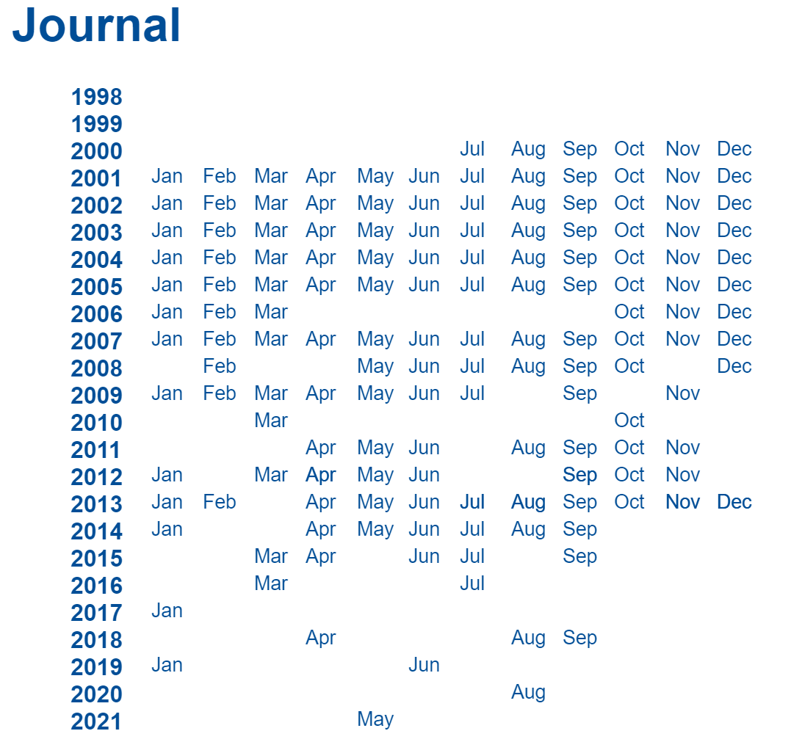
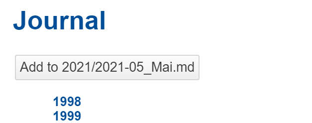
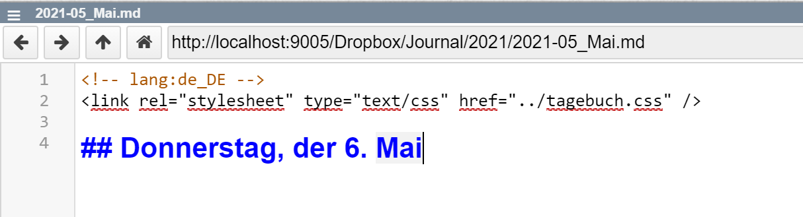

## 2021-05-06 #Dropbox #Journal #Application
*Author: @JensLincke*

I just replaced my statically (first Emacs, that ruby) generated Journal index page with a fresh dynamic #Lively4 one.

**Old Index Page:**

{width=600px}

**New Dynamic Index:**

{width=300px}

And the script...

```javascript
  var container = lively.query(this, "lively-container")
  var list;
  var base = container.getDir();
  (async () => {
    list = await fetch(base, {
      method: "OPTIONS",
      headers: {
         filelist: true
      }
    }).then(r => r.json())

    var entries = list.contents.filter(ea => ea.name.match(/^\.\/\d\d\d\d\//))
    var years = _.groupBy(entries, ea => ea.name.replace(/^\.\//,"").replace(/\/.*/,""))
    var yearElements = []
    
    let monthNames = ["Jan", "Feb", "Mar", "Apr", "May", "Jun", "Jul", "Aug", "Sep", "Oct", "Nov", "Dec"]


    for(let year of Object.keys(years)) {
      var list = <span class="months"></span>
      var yearElement = <div class="year"><span class="label"><a click={() => lively.openBrowser(base + year)}>{year}</a></span> {list}</div>
      yearElements.push(yearElement)


      var groups = _.groupBy(years[year], ea => ea.name.replace(/^\.\//,"").replace(/\..*/,""))
      for(var key of Object.keys(groups)) {
        var matchMonth = key.match(/\d\d\d\d-(\d\d)_/)
        if (matchMonth) {
          // sparse table layout... this time a little bit different
          var w = 35 // column width
          var i = parseInt(matchMonth[1])
          let allFiles = groups[key]

          // prefere Markdown format then HTML over others
          let file 
          file = allFiles.find(ea => ea.name.match(/\.md$/))
          if (!file) file = allFiles.find(ea => ea.name.match(/\.html$/))
          if (!file) file = allFiles[0]

          let url = base + file.name
          var monthName = monthNames[i-1]
          var monthElement = <div class="month "><a click={() => lively.openBrowser(url)}>{monthName}</a></div>
          list.appendChild(monthElement)
          lively.setPosition(monthElement, lively.pt(w * i + 20, 0))
        }
      }

    }
    var style = document.createElement("style")
    style.textContent = `
      .year .label {
        font-weight: bold;
      }

      .year {
        position: relative;
      }
      .month {
        font-size: 10pt;

      }
    `
    return <div>
      {style}
      <ul>{...yearElements}</ul>
    </div>
  })()
```

## And here is a button that creates a new entry... from a template

Just for archiving purposes.... or future refactoring into a proper component!

{width=300px}

which will create or jump to the proper entry of the month!

{width=300px}


```javascript
import moment from "src/external/moment.js"
  var container = lively.query(this, "lively-container")
  
  class JournalEntry {
  
    static monthName(date) {
      var monthNames = "Januar, Februar, März, April, Mai, Juni, Juli, August, September, Oktober, November, Dezember".split(", ")
      return monthNames[date.getMonth()]   
    }
  
    static async addOrCreateButtonForToday(container) {    
      this.container = container
      this.base = container.getDir();
      
      // #TODO use moment.js lang?

      var file = moment(day).format("YYYY/YYYY-MM_") + this.monthName(day) + ".md";
      var url = this.base + file
      if (await lively.files.exists(url)) {
       
        return <button click={() => this.addEntryTo(url)}>Add to {file}</button>
      } else {
        return <button click={() => this.createAndaddEntryTo(url)}>Create {file}</button>
      } 
    }

    static async createAndaddEntryTo(url) {
      var templateURL = this.base + "template.md"
      await lively.files.copyURLtoURL(templateURL, url)      
      return this.addEntryTo(url)
    }

    
    static async addEntryTo(url) {
      var today = new Date()
      
      var weekdayNames = "Sonntag, Montag, Dienstag, Mittwoch, Donnerstag, Samstag".split(", ")
      
      var content = await lively.files.loadFile(url)
        
      var dayAndMonth = weekdayNames[today.getDay()] +", der " + today.getDate() + ". " + this.monthName(today)
      var heading = "## " + dayAndMonth
      
      if (!content.match(heading)) {
        lively.notify("add heading", dayAndMonth)
        content = content.replace(/\n+$/,"") // remove trailing newlines
        content += "\n\n" + heading        
        await lively.files.saveFile(url, content)
        lively.notify("added " + dayAndMonth)
      } 
      lively.openBrowser(url, true, dayAndMonth)
      lively.notify("goto heading", dayAndMonth) 
    }
  }
  
  JournalEntry.addOrCreateButtonForToday(container)
```


