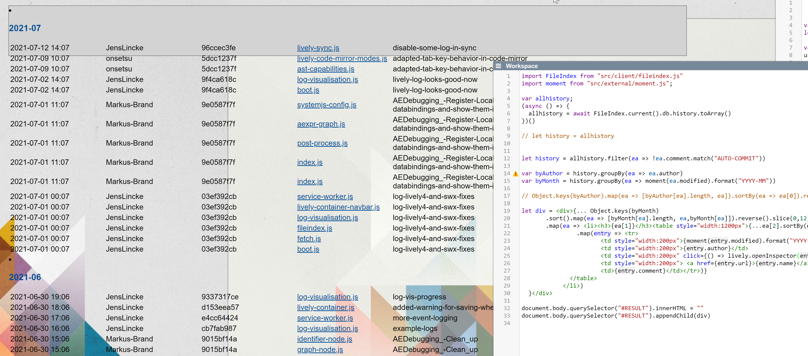

## 2021-07-14 Some Changelog #Workspace
*Author: @JensLincke*

 #ToBeContinued

```javascript
import FileIndex from "src/client/fileindex.js"
import moment from "src/external/moment.js";

var allhistory;
(async () => {
  allhistory = await FileIndex.current().db.history.toArray()
})()

// let history = allhistory


let history = allhistory.filter(ea => !ea.comment.match("AUTO-COMMIT"))

var byAuthor = history.groupBy(ea => ea.author)
var byMonth = history.groupBy(ea => moment(ea.modified).format("YYYY-MM"))

// Object.keys(byAuthor).map(ea => [byAuthor[ea].length, ea]).sortBy(ea => ea[0]).reverse()

let div = <div>{... Object.keys(byMonth)
       .sort().map(ea => [byMonth[ea].length, ea,byMonth[ea]]).reverse().slice(0,12)
       .map(ea => <li><h3>{ea[1]}</h3><table style="width:1200px">{...ea[2].sortBy(entry => moment(entry.modified).toISOString()).reverse()
                .map(entry => <tr>
                       <td style="width:200px">{moment(entry.modified).format("YYYY-MM-DD HH:MM")}</td>
                       <td style="width:200px">{entry.author}</td>
                       <td style="width:200px" click={() => lively.openInspector(entry)}>{entry.version}</td>
                       <td style="width:200px"> <a href={entry.url}>{entry.name}</a></td>
                       <td>{entry.comment}</td></tr>)}
              </table>
            </li>)
  }</div>

document.body.querySelector("#RESULT").innerHTML = ""
document.body.querySelector("#RESULT").appendChild(div)
```  


