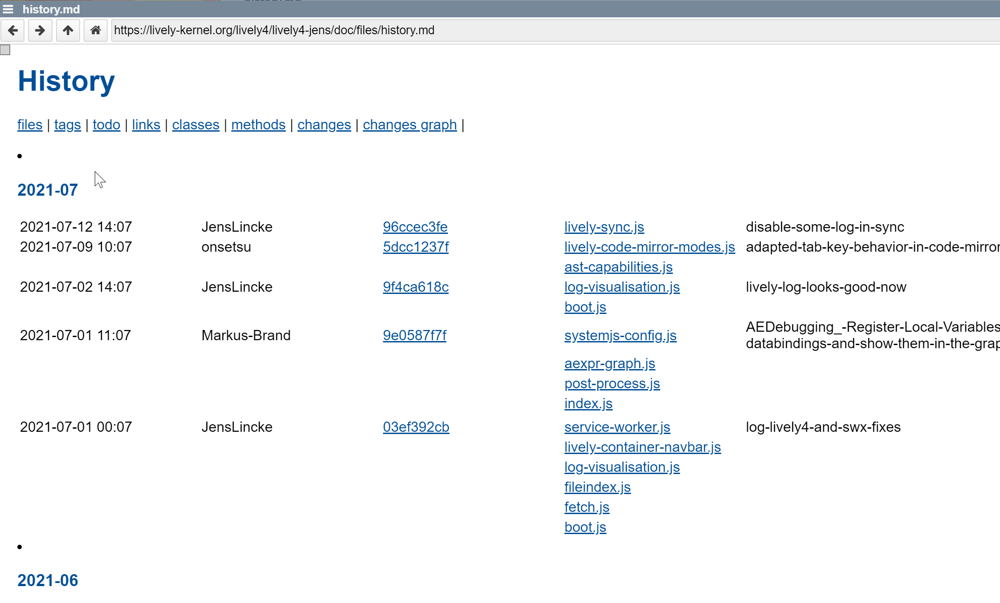
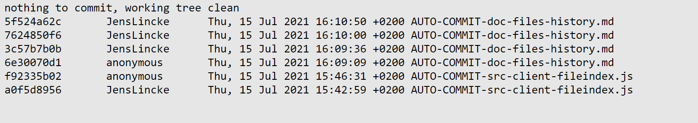

## 2021-07-15 #ChangeHistory
*Author: @JensLincke*

<browse://doc/files/history.md>

## Bug Lively Server / PUT / SWX?

There seems to be situations when the server gets confused ...
is it a server side thing (e.g. multiple users?) or is it on the client side... e.g. editor / fetch / swx? We should have an eye on this...

