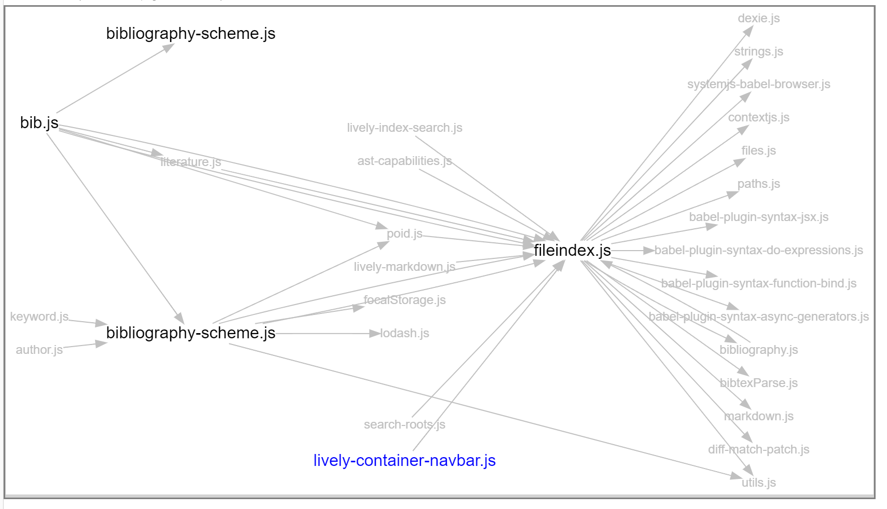
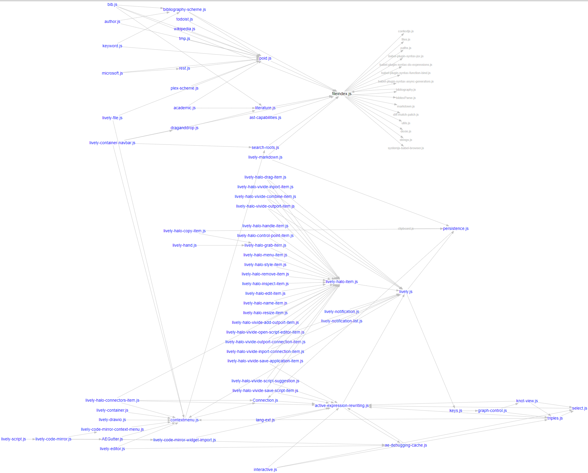

## 2021-11-24 New Module Dependency Graph
*Author: @JensLincke*

<browse://src/client/graphviz/dependencies.md>

dependentdepending
## Shit, we have to rethink about module updating and reloading all dependencies

I would propose three levels of module updating...

1. full recursive module reload...
  - e.g. support updating of components when superclass changes
2. patch in reference to new  module into the depending module 
  - this breaks if the depending module has already done something with it... e.g. used it for subclassing
3. do nothing... the depending module keeps a reference to the old module... this may be fine in some cases?

