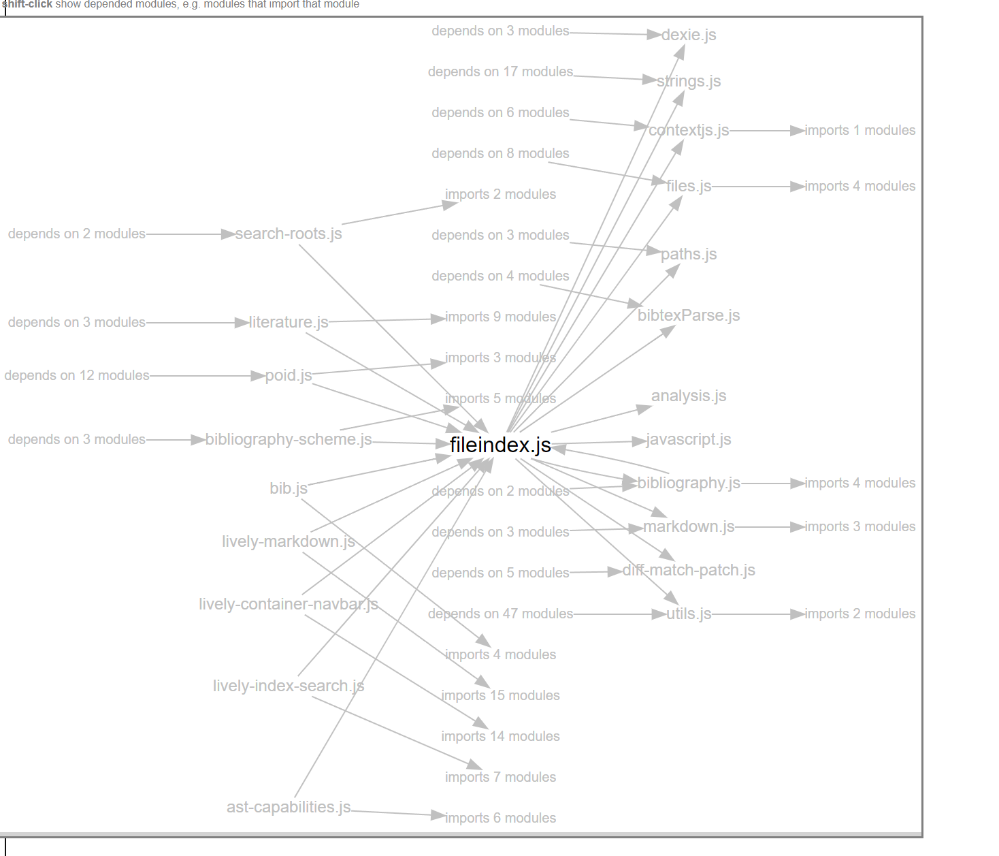
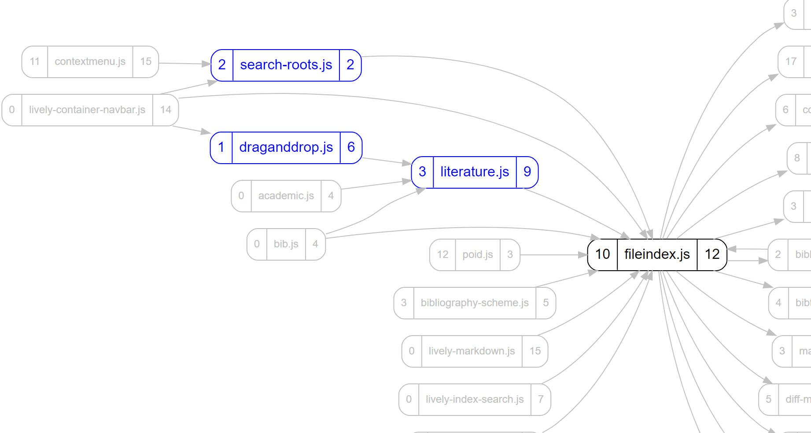

## 2021-11-29 Dependency Visualizer
*Author: @JensLincke*

<browse://src/client/graphviz/dependencies.md>

Just for archiving purposes.... imports and dependend nodes are grouped as abstract nodes in visualization. But it does not look good, because they cannot be layouted specially... but are thrown into the ranks of all nodes.

And now the same functionality with better UX

