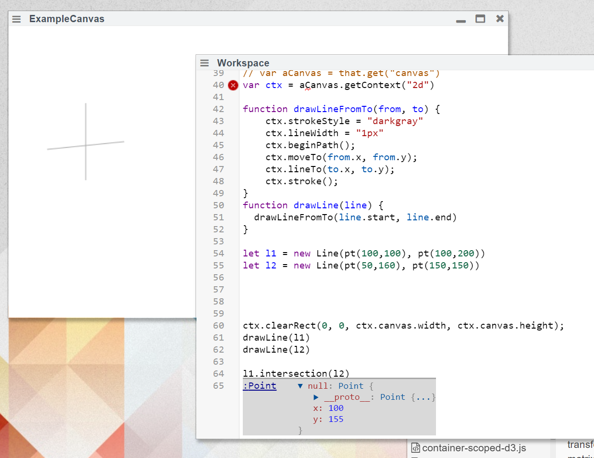

## 2022-01-27 Line intersection works again
*Author: @JensLincke*



With the help of a little workspace... for feedback

Because the <edit://src/client/graphics.js> package is so deep inside the system... live programming on it is not fun. Except, if one works on a copy... a second system. And here we are again...

```javascript

import {pt, rect, Point, Line, Transform} from "src/client/graphics.js"

Line.prototype.intersection = function intersection(otherLine) {
    // returns true if the line from (a,b)->(c,d) intersects with (p,q)->(r,s)
  // https://stackoverflow.com/questions/9043805/test-if-two-lines-intersect-javascript-function
       //       .. (x1, y1)
    //         ..              ..... (x4,y4)
    //           ..    ........
    // (x3,y3) .....X..
    //    .....      ..
    //                 ..  (x2, y2)
    var eps = 0.0001,
        start1 = this.start,
        end1 = this.end,
        start2 = otherLine.start,
        end2 = otherLine.end,
        x1 = start1.x,
        y1 = start1.y,
        x2 = end1.x,
        y2 = end1.y,
        x3 = start2.x,
        y3 = start2.y,
        x4 = end2.x,
        y4 = end2.y;

    var x = ((x1*y2-y1*x2)*(x3-x4)-(x1-x2)*(x3*y4-y3*x4)) /
            ((x1-x2)*(y3-y4)-(y1-y2)*(x3-x4)),
        y = ((x1*y2-y1*x2)*(y3-y4)-(y1-y2)*(x3*y4-y3*x4)) /
            ((x1-x2)*(y3-y4)-(y1-y2)*(x3-x4));

    // are lines parallel?
    if (x === Infinity || y === Infinity) return null;

    return pt(x,y);
  }
 

// var aCanvas = that.get("canvas")
var ctx = aCanvas.getContext("2d")

function drawLineFromTo(from, to) {
    ctx.strokeStyle = "darkgray"
    ctx.lineWidth = "1px"
    ctx.beginPath();
    ctx.moveTo(from.x, from.y);
    ctx.lineTo(to.x, to.y);
    ctx.stroke();
}
function drawLine(line) {
  drawLineFromTo(line.start, line.end)
}

let l1 = new Line(pt(100,100), pt(100,200))
let l2 = new Line(pt(50,160), pt(150,150))


ctx.clearRect(0, 0, ctx.canvas.width, ctx.canvas.height);
drawLine(l1)
drawLine(l2)

l1.intersection(l2)
```

Turned out, the original code contained some "constraint" check that used some num.between function, that I had to guess how it worked...


```javascript 
      function between(x, x1, x2, eps) {
      return  (x + eps > (x1 - eps)) && (x - eps < (x2 + eps))
    }
    if (!unconstrained) {
      if (!between(x, x1, x2, eps)
      ||  !between(y, y1, y2, eps)
      ||  !between(x, x3, x4, eps)
      ||  !between(y, y3, y4, eps)) return null;
    }
```

But it did not, at least not for this numbers... so I disabled it. 
    
```javascript
let l1 = new Line(pt(100,100), pt(100,200))
let l2 = new Line(pt(50,160), pt(150,150))

l1.intersection(l2)
```

