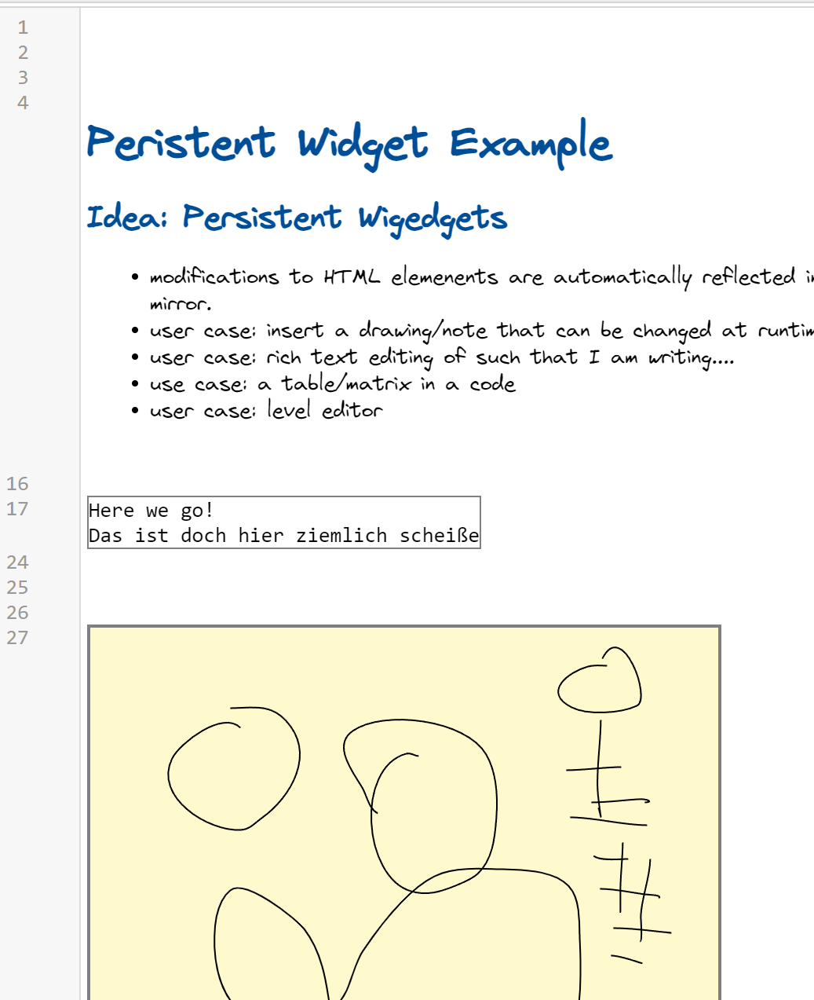

## 2022-02-10
*Author: @JensLincke*

Good old #ContextJS script for development... when you don't want to bother  wrapping  your own methods


```javascript
import * as cop from "src/client/ContextJS/src/contextjs.js"


// var codeMirror = lively.query(that, "lively-code-mirror")

cop.layer(window, "DevLayer").refineObject(codeMirror.editor.display.input, {
  focus() {
    console.log("focus!",  lively.stack())
    
    return cop.proceed()
  }
})


DevLayer.beGlobal()
```

The code is still ugly but I can do what I was setting out to do. I can add notes to code and still draw in them and changes are persisted. 
The problem was not the note drawing but the more general and difficult case of content editable html elments and fighting over focus of widgets and the code mirror. 

