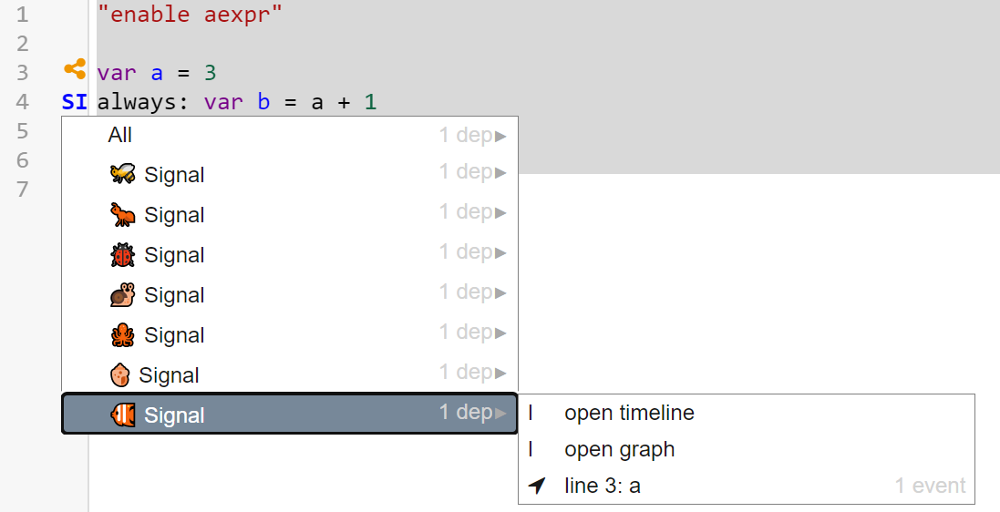

## 2023-01-23 Back in Lively!
*Author: @JensLincke*

I am back with some time to work on Lively4 again. What are our big open ends:

- [ ] [finish big babel 7 refactoring?](browse://doc/issues/414/)
- [ ] garbage collection for aexpr to make #Signals, #Connectors, #ILA usable?
- [ ] finish the microsoft academics replacement #Literature #Bibliography
- [ ] get our CI green with chrome 109
  - [example snippet that does not work](./issue-ae-chrome109.md)
- [ ] write Paper about JavaScript in markdown and markdown in JavaScript #Paper #Idea

## Garbage Collection for ActiveExpressions

Since it was an issue in our work for AE tool support and @onsetsu has to write-up, let's have a look myself.
It seems that the active expressions are not automatically garbage collected. Lets recreate the problem before looking at our possible ideas how to fix them. 

<edit://doc/journal/2023-01-23.md/test-ae.js>
/test-ae.js "AE code with Signals"


Working interactively with a code with signals will result in lots of garbage active expressions, that are still lying around and pointing to these lines of code. But from my developers point of view I think they should not be there. 

{width=600px}

### WeakRefs to the rescue?

<https://developer.mozilla.org/en-US/docs/Web/JavaScript/Reference/Global_Objects/WeakRef>


```javascript {.Example}
import * as counter from "doc/journal/2023-01-23.md/weakref-counter.js"
counter.start()
```

<!-- does break chrome console....
<div style="height:300px;width:6000px;position:relative">
<lively-console tabindex="0" ></lively-console>
</div>
-->

<script>
import {hideHiddenElements, toggleLayer, showVariable, runExampleButton} from "src/client/essay.js";
runExampleButton("run", this, ["Example"]);
</script>

As we have seen WeakRefs seem to work now. But can we apply them to our problem? So first we have to figure out if 
the problem is caused:
- by AE, 
- by signals, 
- or by the tooling on top.

### AE and WeakRefs


<style>
  pre:not(#LOG) {
    background-color:  rgba(240,240,250,1);
    padding: 6px;
    width: 800px;
  }
</style>


<!-- cheap log component -->
<div id="examplespace" style="position:sticky; top: 10px; left: 850px;padding: 10px;width: 340px;">
  <div style="position:relative; height:0px;overflow:show">
    <div style="background:rgba(240,240,240,0.8);  border: 1px dashed gray">
      <pre id="LOG" style="display: inline-block; overflow:auto; width: 200px; height: 300px; backgroundColor: gray;border: 1px solid gray; margin: 0px; vertical-align: top; padding: 5px"></pre>
    </div>
  </div>
</div>

```javascript {.LogMorph .Hidden}
// Some log tool
var logComonent  = lively.query(this, "#LOG")
logComonent.mode  ="text/plain"
logComonent.parentElement.setAttribute("title", "Log")
logComonent.textContent = ""

function log(s) {
   logComonent.textContent += s + `
`
}
```

#### AE on objects

AE on objects seem to work fine:


```javascript {.JoeChanges .NoResult}
var o = {name: "Joe", changes: 0}

// count the name changes
aexpr(() => {
  return o.name
}).onChange(() => {
  log('changed name')
  o.changes++
})

log("o.name=" + o.name)
log(o.changes)
o.name = "foo"
log("o.name=" + o.name)
log(o.changes)


```
<script>
runExampleButton("run", this, ["LogMorph", "JoeChanges"]);
</script>

#### AE on (module/global) variables

Lets check if this works also with variables...

```javascript {.VarChanges .NoResult}
var a = "hello"
var changes = 0

// count the name changes
aexpr(() => {
  return a
}).onChange(() => {
  log('changed a')
  changes++
})

export function run() {
  log("a=" + a)
  log(changes)
  a = "foo"
  log("a=" + a)
  log(changes)
}
run()
```
<script>
runExampleButton("run", this, ["LogMorph", "VarChanges"]);
</script>


This seems to run fine. Maybe because we freshly evaluate everything. Lets try moving it into a module. 

/test-ae-var.js "test-ae-var.js: AE code in module with module global variables"


```javascript {.VarChangesInModule .NoResult}
import * as m from "doc/journal/2023-01-23.md/test-ae-var.js"
m.setLog(log) // #TODO hide essay code?
```

```javascript {.VarChangesInModuleRun .NoResult}
m.run()
```
<script>
runExampleButton("run", this, ["LogMorph", "VarChangesInModule", "VarChangesInModuleRun"]);
</script>

What we found out at this place is that there seems to be an issue with aexpr in modules vs in a workspace at the moment in Lively4. This might be caused by the  babel5 to babel7 refactoring. So everything comes together here.... #TODO 


```javascript {.VarChangesInModuleReset .NoResult}
m.reset()
```
<script>
runExampleButton("run", this, ["LogMorph", "VarChangesInModule","VarChangesInModuleReset"]);
</script>


# META

- the runExampleButton does its job, but why not generate them for each Code snippet....
- the runExampleButton encodes also the dependencies of a specific run. Maybe we can mark them explicitly?
  - ObservalesHQ finds and evaluates dependent cells based on analysing the source code and the dependency of variables used... #RefNeeded
  - Jupyter Notebooks does not automatical rerun all the dependencies in the first place #RefNeeded
-   
  
  


<script>hideHiddenElements(this)</script>

