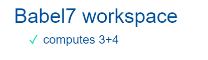

## 2023-02-08 Mocking SystemJS in tests
*Author: @JensLincke*


To [test the babel7](edit://test/babel/babel7-test.js) rewriting code, we first tried to disable the SystemJS module rewriting or work around it. But when it comes to testing workspace code, this is not enough. The workspace plugin makes use of exports, so disabling is not an option because a very simple `3+4` will look like this: 

```javascript 
System.register([], function (_export, _context) {
      "use strict";
      
      var __SystemJSRewritingHack, __result__;
      return {
        setters: [],
        execute: function () {
          __SystemJSRewritingHack = {};
          _recorder_._file_js = _recorder_._file_js || {};
          _export("__result__", __result__ = 3 + 4);
          _export("__result__", __result__);
        }
      };
    }););'
``` 

To be able to evaluate this, but without having to instrument SystemJS even more, a mock that replaces `System` will provide a very simple solution.  

```javascript
    var preMockSystemJS = `
var _mod;
var _exports = {}
var System = {
  register: function(deps, func) {
    _mod = func(function _export(key, value) { _exports[key] = value}, {})
  }
};`
    var postMockSystemJS = `
;_mod.execute(); _exports.__result__
`
expect(eval(preMockSystemJS + code + postMockSystemJS)).to.equal(evaluationResult);
```

And it worked: 

{width=200}
