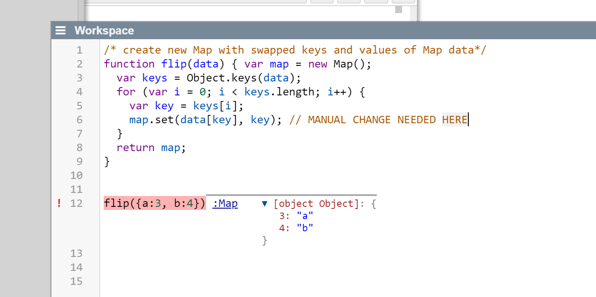

## 2023-02-16 Experiment SWACopilot
*Author: @JensLincke*


Use Alt+K #KeyboardShortcut 




```javascript
async trySWACopilot(text) {
    var start = Date.now()
    var result = await fetch(`https://lively-kernel.org/swacopilot?maxlength=300&temperature=0.4&text=` + 
                              encodeURIComponent(text)).then(r => r.json())
    if(result.generation) {
      this.editor.setCursor(this.editor.getCursor("end"));
      this.editor.replaceSelection(result.generation, "around");
    }
    lively.notify("SWA Copilot: " + (Date.now() - start) + "ms")
  } 
```