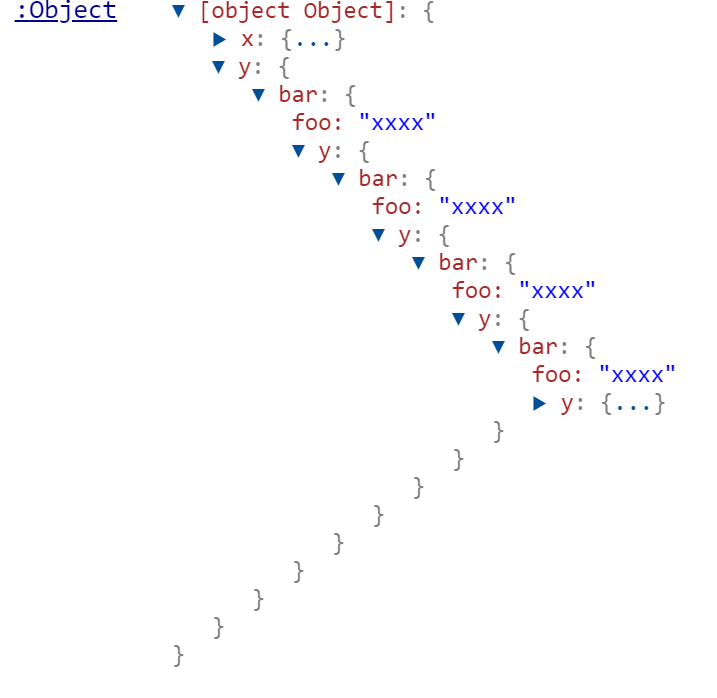
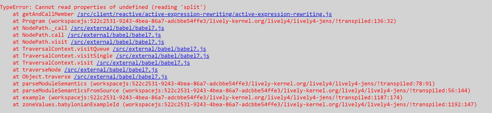

## 2023-05-04 #Bug #deepClone #Babel7
*Author: @JensLincke*

Today, we found a bug in Babel7... when generating code in Babylonian...

```javascript
function deepClone(value, cache) {
  if (value !== null) {
    if (cache.has(value)) return cache.get(value);
    let cloned;
    if (Array.isArray(value)) {
      cloned = new Array(value.length);
      for (let i = 0; i < value.length; i++) {
        cloned[i] = typeof value[i] !== "object" ? value[i] : deepClone(value[i], cache);
      }
    } else {
      cloned = {};
      const keys = Object.keys(value);
      for (let i = 0; i < keys.length; i++) {
        const key = keys[i];
        cloned[key] = typeof value[key] !== "object" ? value[key] : deepClone(value[key], cache);
      }
    }
    cache.set(value, cloned);
    return cloned;
  }
  return value;
}


var o = {}
o["x"] = {foo: "xxxx"}
o["y"] = {bar: o["x"] }

o["x"].y = o["y"] // insert cycle here...

deepClone(o, new Map()) // Error: Maximum call stack size exceeded

```

## Solution: Make the deepClone work with cycles...


```javascript
function deepClone(value, cache) {
  if (value !== null) {
    if (cache.has(value)) return cache.get(value);
    let cloned;
    if (Array.isArray(value)) {
      cloned = new Array(value.length);
      cache.set(value, cloned); // CHANGE: register clone before continuing
      for (let i = 0; i < value.length; i++) {
        cloned[i] = typeof value[i] !== "object" ? value[i] : deepClone(value[i], cache);
      }
    } else {
      cloned = {};
      cache.set(value, cloned); // CHANGE: register clone before continuing
      const keys = Object.keys(value); 
      for (let i = 0; i < keys.length; i++) {
        const key = keys[i];
        cloned[key] = typeof value[key] !== "object" ? value[key] : deepClone(value[key], cache);
      }
    }
    return cloned;
  }
  return value;
}


var o = {}
o["x"] = {foo: "xxxx"}
o["y"] = {bar: o["x"] }

o["x"].y = o["y"] // insert cycle here...

deepClone(o, new Map()) 

```

{width=400px}

As it turns out... this was a known and fixed issue... https://github.com/babel/babel/pull/15366. Updating babel pulled in the fix for us.

## Zones are a bit broken... errors can escape!

{width=600px}


