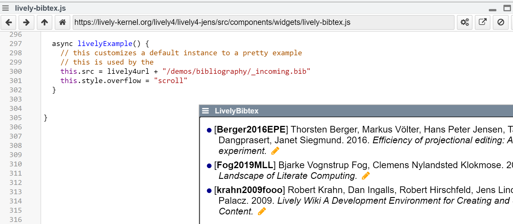

## 2023-05-08 #ScriptExamples #TODO
*Author: @JensLincke*

We need Script examples and maybe unify the various places to create, store, invoke, and play with examples in Lively4. 

### Workspaces

- handy tool
- code is only preserved locally in as session, but is not shared with colleagues

### Code Snippets in Markdown

Simple JavaScript listings in markdown. Can be actived when by manually copy them to a workspace and running them there. Code changes in that workspace are not preserved.  

### Scripts in Markdown

Active code snippets in Markdown files. Are executed while rendering the page and may keep active and are part of the content. Can only be read in edit mode.

### Active Code Snippets in Markdown

By combining passive listings with active scripts, the mix can become a powerful active essay like experience. Code snippets are both rendered and executed. The scripts can only be changed in Edit mode and the reader can not experiment with them or change parameters without first opening the whole page in edit mode. 

### Tests

Tests also contain example code. When test runner is opened, they are automatically executed when editing components or tests. They are also executed in CI.

### Lively Examples

<edit://src/components/widgets/lively-bibtex.js>

{width=400px}

Every JavaScript component can implement `livelyExample`, which creates and example when pressing the generic "apply code and template" button in the editor (#LivelyContainer). 

- one example per component, change examples by changing source code (no editor support)

### JavaScript listings in Markdown Commonents in JavaScript files

<edit://src/omponents/widgets/lively-notification.js>

{width=400px}

### Active Code Snippets in Inline Documentation

<edit://src/client/bibliography.js>

### Examples in Babylonian Programming

- Examples per Method

